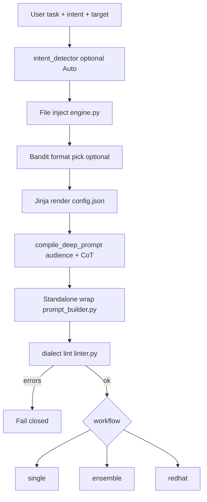
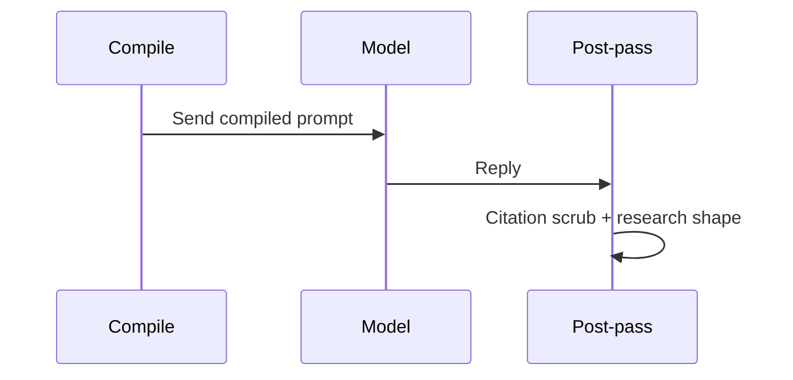
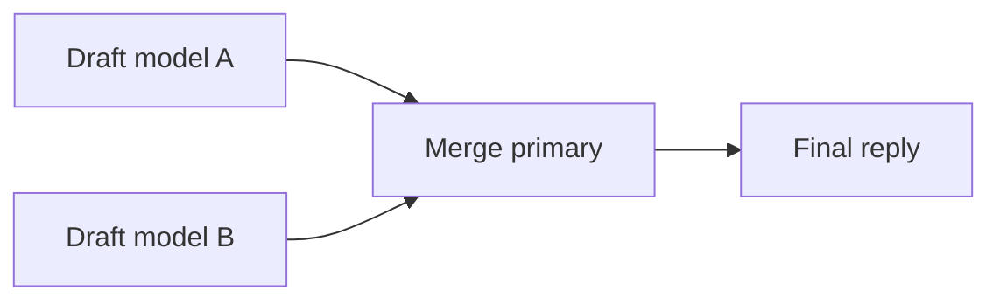
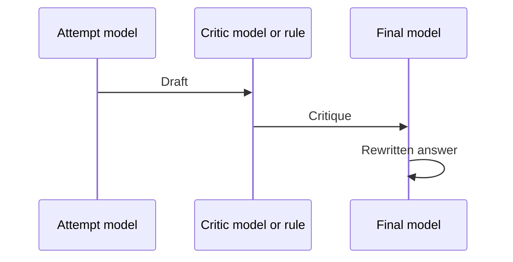

# PEM compiler, data analytics, and workflow models

Reference for Assure’s **Prompt Engineering Matrix (PEM)** engine in `prompt_matrix/`.  
“Compiler” here means **prompt compiler** (Jinja dialect renderer), not a programming-language compiler.

---

## 1. Glossary

| Term | Meaning |
|------|---------|
| **Compile** | Turn task + intent + files → model-specific prompt dialect. No model call unless Send/direct. |
| **Send / direct** | Call LiteLLM (or local runner) with the compiled prompt. |
| **Copy** | Compile only; put prompt on clipboard. |
| **Intent** | Output shape: `research`, `design`, `comparison`, `debug`, `analysis`. |
| **Workflow** | How many models and passes: `single`, `ensemble`, `redhat`. |
| **Dialect** | Per-target template in `config.json` (Claude XML, Gemini plain, DeepSeek markdown, etc.). |
| **run_hash** | SHA digest of compiled prompt; keys history and feedback. |
| **Closed / open** | Closed = keys stay local. Open = cloud wallet / hosted Send. |

---

## 2. Compiler pipeline

Every workflow starts with the same compile prefix.

### Stages (modules)

| Stage | Module | Notes |
|-------|--------|-------|
| Matrix load | `engine.py` | `config.json` targets + intents |
| File inject | `engine.py` | `@file`, globs; 200 KB/file, 500 KB total, 20 files max |
| Jinja render | `engine.py` → `render_prompt_detailed()` | StrictUndefined templates |
| Deep compile | `pipelines.py` → `compile_deep_prompt()` | Audience block; CoT suffix on research/analysis |
| Standalone wrap | `core/prompt_builder.py` | “No web search” rules for non-Cursor targets |
| Dialect lint | `linter.py` | Static checks before Send |

### Targets (dialects)

From `config.json`: **Claude**, **Gemini**, **DeepSeek**, **Kimi**, **Ollama**, **Cursor** (compile-only, no LiteLLM).

### Compile-only surfaces (no model call)

| Surface | Tool / route |
|---------|----------------|
| MCP | `pem_compile`, `pem_dialect_lint`, `pem_export` |
| Web | `POST /api/preview` |
| CLI | default without `--direct` |

---

## 3. Workflow models

Central entry: **`run_workflow()`** in `pipelines.py`.  
IDs: **`single`**, **`ensemble`**, **`redhat`**.

UI labels (i18n): Quick Answer / Compare & Validate / Refine & Verify.

### 3.1 Single (`single`)

| | |
|--|--|
| **Product name** | Quick Answer |
| **Flow** | One compile → one model → one reply |
| **Optional** | Grounding rewrite (second pass strips unsupported claims) |
| **Default** | CLI `--workflow single`; MCP has no `pem_single` |
| **Steps** | `draft` |

### 3.2 Ensemble / Combine (`ensemble`)

| | |
|--|--|
| **Product name** | Compare & Validate |
| **Flow** | 2+ models draft in各自的 dialects → one merge pass |
| **Merge rules** | Consensus once; show disagreements; drop one-sided unsourced claims |
| **MCP** | `pem_combine` (default primary Gemini, extra DeepSeek) |
| **Web default** | Compose default workflow |
| **Edition** | Free clamps to 2 models; Pro up to 8 |
| **Steps** | `draft` (×N) → `merge` |

### 3.3 Red-hat / Critique-rewrite (`redhat`)

| | |
|--|--|
| **Product name** | Refine & Verify |
| **Flow** | Attempt → critic → final rewrite (one round, not loop-until-perfect) |
| **Personas** | `redhat`, `security`, `tokens`, `schema`, `code` (`personas.py`) |
| **Rule critic** | `--critic rule` → local `agents/rule_critic.py`, no API |
| **Cap** | `workflow_cap.py` — `PEM_WORKFLOW_TIMEOUT` (default 120s) |
| **MCP** | `pem_critique_rewrite` |
| **Steps** | `attempt` → `critique` → `final` |

### 3.4 Post-reply pass (all Send workflows)

Runs after a successful direct Send when `result.reply` exists:

1. **Citation scrub** — `agents/critique.py`
2. **Research shape** — `agents/final.py` (Verified / Inferred sections)
3. **Token count** — `token_counter.py` (tiktoken)
4. **Cost estimate** — `cost_router.py`
5. **History row** — `history.record_run()`
6. **Quality score** — `quality.score_run()`
7. **Bandit feedback** — `template_library.record_outcome()` + `record_performance()` if improve loop on
8. **Optional full text** — `store_full_run()` when edition allows / `PEM_STORE_PROMPTS=1`

### 3.5 Swarm (development orchestration)

**Not** a user Q&A workflow. Builds product features via multi-agent dev pipeline.

| Phase | Roles | PEM intent | Typical workflow |
|-------|-------|------------|------------------|
| 1 | architect → developer → reviewer | design / debug / analysis | `single` |
| 2 | red-hat rounds until Keep or cap | analysis | `redhat` |
| 3 | tester ∥ documenter | debug | `single` / parallel threads |

- Module: `swarm.py`, job state: `swarm_job.py`, pre-apply lint: `swarm_lint.py`
- MCP: `swarm_start`, `swarm_status`, `swarm_develop`
- Guard: `safe_swarm.py` at repo root

---

## 4. Data analytics

Analytics are **local-first** (SQLite on the machine). There is no separate analytics service.

**Database path:** `~/.assure/history.sqlite` (override: `DATABASE_PATH`).

### 4.1 Tables

| Table | Module | Purpose |
|-------|--------|---------|
| `executions` | `history.py` | Per-run metadata: timestamp, target, intent, workflow, persona, tokens, est. cost, flags |
| `prompt_versions` | `history.py` | Full compiled prompt + final reply (Pro+ / `PEM_STORE_PROMPTS=1`) |
| `prompt_variations` | `template_library.py` | Bandit format strings per intent/domain/model |
| `prompt_performance` | `template_library.py` | Per-run quality metrics keyed by `run_hash` |
| `daily_sends` | `history.py` | UTC daily Send quota |
| `user_subscriptions` | `history.py` | Cloud tier cache (Clerk user → edition) |

### 4.2 `executions` fields (analytics grain)

Core: `timestamp`, `target_ai`, `intent`, `workflow`, `persona`, `task`, `prompt_hash`, `prompt_chars`, `reply_chars`.

Extended: `input_tokens`, `output_tokens`, `total_tokens`, `estimated_cost`, `extra_targets`, `ground`, `cheap`, `local`, `class_id`, `critic`, `edition`, `context`.

**Enable history:** `PEM_ENABLE_HISTORY=1` or `--history`.

### 4.3 Quality metrics (`quality.score_run`)

Computed locally after Send — **no extra model call** (`PEM_QUALITY_JUDGE` unused).

| Metric | Definition |
|--------|------------|
| `consensus_score` | Jaccard word overlap across ensemble drafts; `null` for single |
| `coherence_score` | Structure heuristic (length, headings, rule_critic findings) |
| `hallucination_rate` | Citation scrubber flagged sentences / claim sentences |
| `token_efficiency` | Quality per 400 tokens, capped at 1 |
| `overall_score` | Weighted blend (consensus included when ≥2 drafts) |
| `grounded_spans` / `inferred_spans` | Char offsets for UI highlighting vs uploaded context |

UI copy: `quality.confidence_text()` → returned on `/api/render`.

### 4.4 Improve loop (bandit)

| Step | Module |
|------|--------|
| Pick format | `bandit.py` + `template_library.pick_variation()` (ε=0.2 default) |
| Seed formats | `variation_generator.py` |
| Record outcome | `record_outcome(variation_id, overall_score)` |
| User feedback | `POST /api/feedback` → ±0.15 on `performance_score` |

Enable: improve loop env / edition gate in `template_library.improve_enabled()`.

### 4.5 Aggregation CLI

| Command | Module | Output |
|---------|--------|--------|
| `assure monitor` | `monitor.py` | Runs, reply rate, tokens, est. USD by model |
| `assure eval --dataset` | `eval_run.py` | Batch accuracy, redteam, quality |
| `assure --ci` | `ci_report.py` | Single JSON: prompt, reply, quality, lint, tokens, `run_hash` |

**Not stored:** request latency (`monitor --show-latency` prints n/a).

---

## 5. Surface → workflow map

| Surface | Compile only | Send workflows |
|---------|--------------|----------------|
| MCP | `pem_compile`, `pem_dialect_lint`, `pem_export` | `pem_combine` → ensemble; `pem_critique_rewrite` → redhat |
| Web Compose | `/api/preview` | `/api/render` → `run_workflow()` (default ensemble) |
| CLI | no `--direct` | `--direct` + `--workflow single\|ensemble\|redhat` |
| Cursor MCP | `target_ai: cursor` on compile tools | N/A in MCP chat |

---

## 6. Configuration knobs

| Knob | Location |
|------|----------|
| Targets / intents / Jinja | `prompt_matrix/config.json` |
| Grounding rules | `config/system_prompt.py` (`PEM_BASE_INSTRUCTION`) |
| Editions / gates | `editions.py` (`free`, `pro`, `team`) |
| Env | `PEM_ENABLE_HISTORY`, `PEM_STORE_PROMPTS`, `PEM_WORKFLOW_TIMEOUT`, `ASSURE_EDITION`, `DATABASE_PATH` |

---

## 7. Module index

| Path | Role |
|------|------|
| `pipelines.py` | `run_workflow`, single/ensemble/redhat, `compile_deep_prompt` |
| `engine.py` | Matrix load, Jinja, file inject, `send_to_llm` |
| `quality.py` | `score_run`, `audit_spans`, `confidence_text` |
| `history.py` | SQLite schema, `record_run`, `usage_summary` |
| `template_library.py` | Bandit tables, feedback |
| `mcp_server.py` | Stdio MCP tools |
| `web.py` | Flask `/api/preview`, `/api/render`, `/api/feedback` |
| `swarm.py` | Dev multi-agent pipeline |
| `PEM.md` | Full product + technical reference (longer) |

---

*Last aligned with codebase: Assure / PEM on branch `p4-account-wallet`.*
