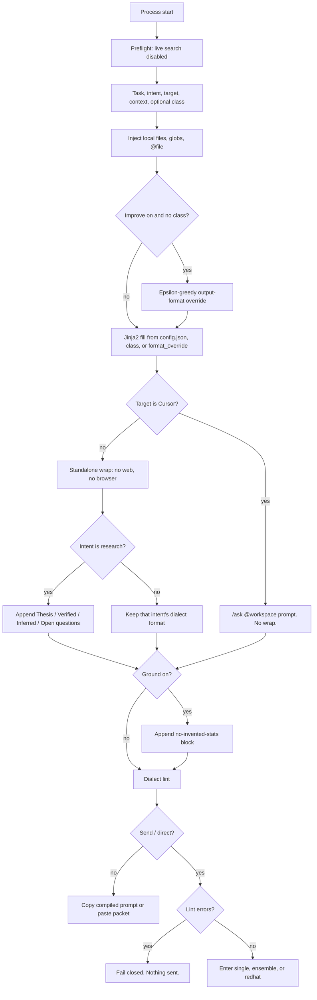
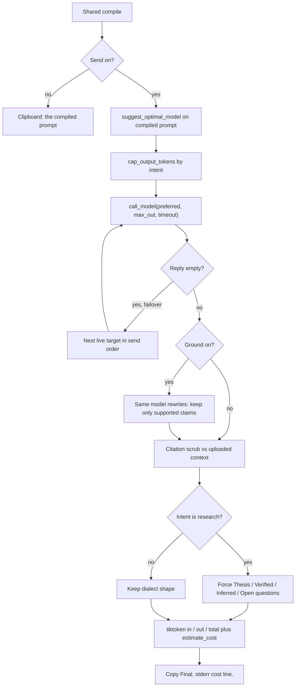
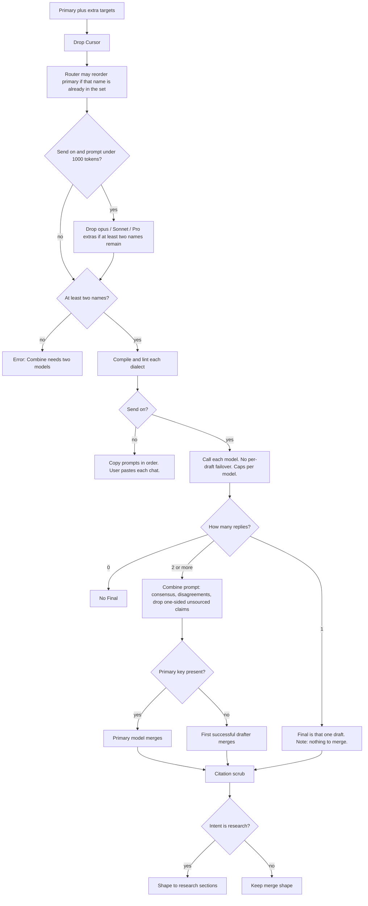
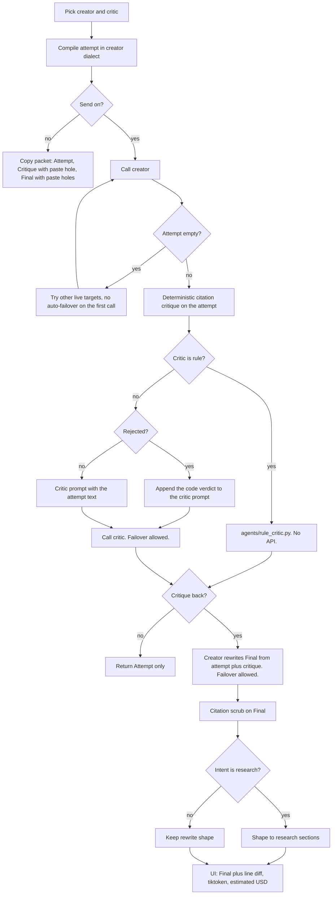
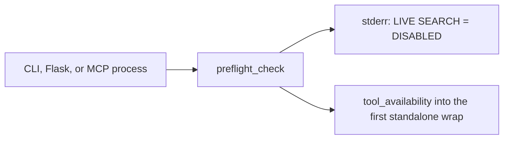

# Assure

Ask one question. Get one answer. The question is rewritten for each model, then checked.

The header subtitle is "Write your question. Restructured for each AI. Validated. One answer." Combine is the default (several models, one merge). Red-hat is the optional critique loop: attempt, critic, rewrite. One pass. Not a loop until perfect.

Assure is the product name on the local UI and CLI. The compiler underneath is still the Prompt Engineering Matrix (PEM), package `prompt_matrix`. Install and flags are in `README.md`. The default page is `http://127.0.0.1:8765`.

The page is a light theme, not the old dark brass layout. Tokens live in `static/style.css` `:root`. Trust Blue `#1A4B8C` is headers, selected tabs, primary buttons, and the field focus ring. Confidence Green `#2E7D32` is Send (when Get my answer is on), the word "trust" in the tagline, connected pills, and the answer badge. Warm Gray `#F7F8FA` is the page background. Light Gray `#E2E8F0` is borders. Accent Gold `#D4A843` is the edition chip only. Warnings use Amber `#E8A838`, not bright red. The footer is Deep Navy `#0D2B45`. Body text is `#2D3748`. Face is IBM Plex Sans, mono is IBM Plex Mono. Spacing is an 8px grid (`--spacing-1` is 4px through `--spacing-12` is 48px). Radii: 4 / 8 / 12 / pill. Buttons use `.btn` plus `.btn-primary`, `.btn-success`, `.btn-outline`, or `.btn-sm`. Fields use `.form-control` and `.select-control`. Panels use `.card`. Cache buster on the live sheet is `?v=assure-22`. Markup is `templates/index.html`. `static/index.html` only redirects to `/`.

This file is the product overview plus the PEM technical reference. Developers can skip to [Technical reference](#technical-reference-the-prompt-engineering-matrix-pem).

## Quick start

Intended public install (not published yet; the PyPI name will be `prompt-matrix`):

```bash
pip install prompt-matrix
assure --web
```

Then open `http://127.0.0.1:8765`. Use `assure` for normal usage. `pem` is the same entry point and still works.

From this repo today:

```bash
cd /Users/og/Untitled/prompt_matrix
python3.13 -m venv .venv
source .venv/bin/activate
pip install -r requirements.txt
pip install -e /Users/og/Untitled
assure --web
```

Full flags are in `README.md`.

## What is Assure?

You type a task, pick a shape (intent), and usually attach a file. Assure compiles a prompt for Claude, Gemini, DeepSeek, Kimi, a local runner, or Cursor.

Two modes:

- **Copy.** The prompt stays on this machine. You paste it somewhere else.
- **Send.** Assure calls the provider you connected. The compiled prompt leaves this machine and goes to that API. Keys stay in `prompt_matrix/.env`.

Default Compose workflow is **Compare & Validate**. Two or more models draft. One merge keeps what they share, shows fights, and drops one-sided unsourced claims. **Refine & Verify** runs attempt, critic, final so you do not copy-paste between chats. **Quick Answer** is a single compile and one reply.

Stop bouncing the same question between Claude, Gemini, DeepSeek, and Kimi by hand. Turn Send on and wait. Read Final. Do not paste the answer back into this page.

PEM has no built-in industry. The case is the file you uploaded and the task you typed.

## Privacy by design

Standalone compile and Copy do not search the web, open a browser, or scrape pages. Preflight prints that live search is disabled and injects that into the first system wrap.

Send is the exception you opt into. The prompt goes to Anthropic, Google, DeepSeek, Moonshot, or a local OpenAI-compatible server, depending on the key or runner you attached. Assure does not add a second cloud of its own.

History is opt-in (`PEM_ENABLE_HISTORY`). Full prompt bodies need `--store-prompts` / `PEM_STORE_PROMPTS`, or a paid edition that forces store after a successful Send. SQLite stays on this disk (`history.sqlite`). Keys are gitignored.

The citation pass is a second filter, not omniscience. A model can still be wrong about facts that are not dates, percents, or named publications.

This Cursor chat may search. Compiled prompts sent to Gemini, DeepSeek, Claude, Kimi, or Ollama may not. Do not expect a standalone run to know last week's news.

## For people who do not want the engine internals

| You need | What Assure does |
| --- | --- |
| Ask a question | Default is Several models. Free Combine uses two (Gemini + DeepSeek when both are live). Pro, Team, and Self-hosted can use up to eight. |
| See if models agree | Combine merge keeps consensus, lists disagreement, drops one-sided claims with no source in the drafts. |
| Catch invented stats | After Send, a citation pass strips dates, percents, and publication names that were not in your upload. Research answers are forced into Thesis / Verified / Inferred / Open questions. |
| Stress-test a draft | Draft, then critique: attempt, critic, final. Free only has the red-hat persona. Pro unlocks security, tokens, schema, and code. |
| Check the prompt itself | Optional Rule critic (`--critic rule`). It runs on this machine with no second model. It is not automatic on every Send. |
| Save time | Send runs the loop. You stay on one page. There is no timed SLA in this repo. |
| Keep copy private | Copy never calls a provider. No live web search. No browser scrape. |
| Reuse a prompt class | Learn structure extracts a class from a prompt you already like. Pro+ can export `.cursorrules`, `.mdc`, Fabric-style `system.md` / `user.md`, or a DSPy stub. Free copies from the UI. Previous work on Pro+ can also save markdown, HTML, Prompty, or a simple PDF. |
| See draft vs final | Pro+ shows the red-hat line diff. Free hides it. |
| Rate an answer | After Send, thumbs up / down (Yes / No labels) under the answer. One rating per run. That score stays on this machine. |
| Spend less on tokens | Cheap route picks from a static USD table in `cost_router.py`. That table is not a live vendor quote. |

## Editions

Gates live in `editions.py`. There is no payment processor, checkout, or billing API in this repo. Default is Free.

Set `ASSURE_EDITION` or `PEM_EDITION`, `config.json` `runtime.edition`, or `--edition`. Values: `free`, `pro`, `team`, `self-hosted`.

```bash
assure --web
assure --web --edition pro
ASSURE_EDITION=self-hosted assure --web
```

| Gate | Free | Pro | Team | Self-hosted |
| --- | --- | --- | --- | --- |
| Sends per UTC day | 10 | 100 | Unlimited | Unlimited |
| Models per Combine | 2 | up to 8 | up to 8 | up to 8 |
| History | hashes, prune after 7 days | full prompt bodies | full prompt bodies | full prompt bodies |
| Class export | blocked | cursorrules, mdc, fabric, dspy | same | same |
| Red-hat line diff | hidden | shown | shown | shown |
| Critic personas | `redhat` | all five | all five | all five |
| Rule critic | yes | yes | yes | yes |
| HTTP Basic Auth on the UI | yes | yes | yes | yes |

Not in this tree: dollar checkout, shareable links, batch evaluation, shared workspaces, OpenTelemetry, RBAC beyond HTTP Basic Auth, priority support. Previous work on Pro+ can export markdown, HTML, Prompty, or a simple PDF. Class export is still cursorrules / mdc / fabric / dspy.

Live UI `/pricing` in this repo: Pro is $5 per month in Stripe test mode. An older product brief listed Pro $9/mo, Team $29/mo, Self-hosted $199 one-time. Those brief figures were not collected here. Until you put Stripe keys in `.env`, `--edition pro` (or `team` / `self-hosted`) still raises the cap on this machine. Paid licenses are not issued from this tree.

# Technical reference: the Prompt Engineering Matrix (PEM)

PEM is a local prompt compiler and optional multi-model runner. You give it a vague task, an intent, and usually a file. It writes a prompt in the dialect of Claude, Gemini, DeepSeek, Kimi, a local model, or Cursor, then either copies that prompt or sends it.

It does not replace Fabric, the `llm` CLI, or Cursor chat. Those tools run prompts. PEM shapes them, can call more than one model, and can refuse to invent facts that were never in the upload.

The package lives in this repo as `prompt_matrix`. Use `assure` for normal usage. `pem` and `python -m prompt_matrix` are the same entry point and still work. Flask `use_reloader` is off, so restart after Python edits.

## What a run does

1. You pick a target AI and an intent (`research`, `design`, `comparison`, `debug`, `analysis`). There is no `code` intent.
2. `config.json` supplies that model's Jinja2 template, the intent's role plus output shape, and optional `runtime` defaults (`max_tokens` 4096, `timeout_seconds` 60, `store_prompts` false, `auth_user` admin, `edition` free, `improve.enabled` true / `epsilon` 0.2). Passwords do not belong in that file.
3. File paths, globs, and `@file` tokens in the task or context get read into the prompt (per-file cap 200 KB, 20 files, 500 KB total).
4. For every standalone target except Cursor, PEM prepends execution rules. Live web search is off. Browser is off. The model may use the uploaded file and its training cutoff.
5. Copy mode puts the prompt on the clipboard. Send / `--direct` calls LiteLLM through `litellm_runner.py` (`stream=False`). Hard caps: `PEM_MAX_TOKENS` (default 4096) and `PEM_TIMEOUT_SECONDS` (default 60). `cost_router.cap_output_tokens` may tighten the output cap by intent (flash/haiku also cap at 1024). A red-hat Send also caps the whole attempt, critique, final loop at `PEM_WORKFLOW_TIMEOUT` (default 120). Timeouts and context-window overflows return an error string instead of hanging. Send fails closed if the dialect linter finds errors. Free/Pro daily Send caps run in `editions.guard_send` before the call.
6. After a live reply, tiktoken counts input, output, and total (`cl100k_base` if the model name is unknown). `estimate_cost` writes a USD estimate from the static table in `cost_router.py` (not a live vendor quote). stderr gets `[Cost Router] Estimated cost: $... for ...`. The UI shows `N in + N out = N tokens (~$... est.)`.
7. Cursor has no public chat API. PEM compiles `/ask @workspace` for paste, or you call PEM from a Cursor agent through MCP.

On process start, standalone PEM prints that live search is disabled and injects that fact into the first system wrap.

CLI flags override `config.json` runtime, which fills env only when the matching variable is unset: `--store-prompts` → `PEM_STORE_PROMPTS`, `--max-tokens` → `PEM_MAX_TOKENS`, `--timeout` → `PEM_TIMEOUT_SECONDS`, `--auth-user` / `--auth-pass` → `PEM_HTTP_USER` / `PEM_HTTP_PASS`, `--critic rule` → `PEM_CRITIC_MODE=rule`, `--cheap` → `PEM_COST_ROUTE`, `--edition` → `ASSURE_EDITION`. `--model` / `PEM_MODEL` wins over cheap routing.

## Feature set

### Dialect compiler

Each target gets a real template, not a string `replace()`:

| Target | Dialect |
| --- | --- |
| Claude | XML `<role>`, `<instructions>`, `<thinking>` |
| Gemini | Plain role/task plus a "Data not available" grounding line |
| DeepSeek | Markdown with `## System Prompt`, `## User Request`, self-correction checklist |
| Kimi | Long-context markdown, tables, answer in the user's language |
| Local (`ollama` id) | Direct markdown. No external API calls from the model |
| Cursor | `/ask @workspace`, code-only output |

Edit `config.json` to change a dialect. `pem --list` prints the loaded targets and intents.

### Intents

Intents set role and output shape. They are not domains. UI hints are plain English (`INTENT_PLAIN` in `editions.py`).

| Intent | What the compiled prompt asks for | Plain hint |
| --- | --- | --- |
| `research` | Thesis, verified findings from the upload, inferred gaps, open questions | I need a structured analysis of this topic. |
| `design` | Goals, constraints, proposed design, tradeoffs, one next step | I need a plan or blueprint. |
| `comparison` | Table, recommendation, what would change the call | I need to decide between options. |
| `debug` | Ranked hypotheses, how to confirm each, first command or code change | I need to fix a problem. |
| `analysis` | Method, results, limits, what the numbers do not prove | I need to understand the numbers. |

The research four-part layout is research only. Other intents keep their own format. After Send, a citation scrub still strips invented dates, percentages, and named publications that were not in the upload. Only research gets forced into Thesis / Verified / Inferred / Open questions.

### Workflows

**Single.** One model, one compiled prompt, one reply. Right before LiteLLM, `suggest_optimal_model(compiled_prompt, intent, user_preference=target_model)` picks a pricing-table key (the selected target or `--model` still wins). That id plus `cap_output_tokens` go into `call_model`.

**Ensemble (Combine).** Two or more models draft. One merge pass keeps consensus, shows disagreement, and drops one-sided unsourced claims. Default pair in MCP is Gemini then DeepSeek. Free clamps extras to one other model (`FREE_ENSEMBLE`). Cursor is compile-only, so it is skipped as a Combine draft target. The cost router may reorder the primary to a member already in the set. On Send, extras that are a bad fit for a short prompt (under 1000 tokens) can be dropped: anything with `opus` in the id, plus Sonnet / Gemini Pro extras. PEM will not shrink the set below two models.

**Red-hat.** Attempt, then a critic that does not write a new essay, then a final rewrite. Personas:

| Id | Critic job | Edition |
| --- | --- | --- |
| `redhat` | Unsupported claims, missing caveats, keep / revise / reject, confidence 0-5 | Free and up |
| `security` | Ambiguity, injection, edge cases, invented APIs or credentials | Pro+ |
| `tokens` | Cut repetition, keep constraints | Pro+ |
| `schema` | Exact JSON / XML / regex shape, no preamble | Pro+ |
| `code` | Logic, bounds, first command or test to try | Pro+ |

Same-model critic is allowed only when both sides are the local `ollama` target. `--critic rule` or `PEM_CRITIC_MODE=rule` skips the LLM critic and runs `agents/rule_critic.py` locally (conflicting roles, tone, word limits vs examples, undeclared Jinja names). No second model and no API key. Attempt and final still need a reachable model if Send is on.

Send-off red-hat returns three paste packets. Send-on runs all three calls. If Ollama is down, Send hops to a connected cloud key instead of dumping paste kits.

Optional **Ground** checkbox (and MCP `ground`) appends the no-invented-stats instruction and, on Send, a second rewrite that keeps only claims supported by the task or context.

### Improve loop (local)

PEM can swap the intent **output-format** string before Jinja compile, then score the Send. It does not replace the dialect compiler. There is no `config.json` `variations` list, no `variation_text.format(task=task)`, and no `random.choice`. A saved class (`class_id`) still wins over the bandit.

`config.json` `runtime.improve` defaults: `enabled` true, `epsilon` 0.2, `generate_with_model` false. `PEM_IMPROVE=0` turns the loop off. `PEM_IMPROVE=1` forces it on.

**Pick (before compile).** If improve is on and there is no `class_id`, `template_library.pick_variation` loads four local seed formats per intent (`variation_generator.seed_texts`) into `prompt_variations`, then epsilon-greedy (`bandit.py`) picks one. That string is `format_override` in `render_prompt_detailed`. `PEM_GENERATE_VARIATIONS=1` (or `improve.generate_with_model`) can add model-written formats **once per intent**. That is one extra Send, not several per question.

**Score (after a successful Send).** `run_hash` is sha256 of the compiled prompt, first 16 hex chars. It goes on `PipelineResult` and `/api/render`. `quality.score_run` writes consensus, coherence, hallucination rate, token efficiency, and `overall_score`. `record_outcome` bumps `usage_count` and rolls `performance_score`. `record_performance` always inserts a `prompt_performance` row on Send (quality columns stay null if improve is off). stderr: `[Improve] overall=... variation=...`.

| Metric | What it is |
| --- | --- |
| Consensus | Jaccard overlap of ensemble draft replies. One-model runs leave this empty. Word overlap, not a judge model. |
| Coherence | Headings, lists, length, and `rule_critic` findings. Not a Gemini Flash judge. `PEM_QUALITY_JUDGE` is reserved and does not fire a hidden Send. |
| Hallucination rate | Flagged citation-scrubber lines over claim sentences. "Data not available" is not a claim. |
| Token efficiency | Combined quality per 400 tokens, capped at 1. |

**Feedback (Compose).** After Send with a reply, thumbs up / down appear under the answer (`#feedback-section`, labels Yes / No plus `aria-label` from `feedback.yes_aria` / `feedback.no_aria`). Copy-only does not show them. `POST /api/feedback` JSON: `run_hash`, `rating` (`1` or `0`), optional `variation_id`. `apply_feedback` looks up `prompt_performance` by `run_hash`. A second rating on the same run returns `{already: true}` and does not change the score. It does not increment `usage_count`. Score is clamped to `[0, 1]`.

| Signal | Delta on `performance_score` |
| --- | --- |
| Helpful | +0.15 |
| Not helpful | -0.15 |
| `hallucination_rate == 0` | +0.05 |
| `total_tokens < 1500` | +0.05 |
| `total_tokens > 3000` | -0.05 |

If the performance row has no token count, PEM reads `executions.total_tokens` where `prompt_hash` equals `run_hash`. Each rating prints `[Improve] feedback=helpful|not variation=...` to stderr. `PEM_IMPROVE_SUMMARY=1` then prints `get_best_variations` rows with `usage_count >= 10`. Scores stay in this machine's `history.sqlite`. They are not shared across users and they do not rewrite `config.json`.

### Tokens

`token_counter.count_tokens` uses tiktoken. Unknown LiteLLM ids fall back to `cl100k_base`. The old chars/4 guess is gone. Counts land on the pipeline result, `/api/render`, the Compose token line, history, and MCP text.

### Cost router

`cost_router.py` holds a static USD-per-1M-token table. Refresh that dict when you care about accuracy. It is not a live vendor API.

- `estimate_cost` after every Send. Local / Ollama is `$0` in that table.
- `cap_output_tokens` by intent: debug 512, comparison 1024, design 1536, analysis 2048, research 4096, then min 1024 for flash/haiku.
- `--cheap` / `PEM_COST_ROUTE=1` / Compose **Cheap route** may switch the live cloud target before compile so the dialect matches. `--model` and `--local` skip that switch. If the preferred provider is down, PEM walks the table for the next cheapest live target.
- Rules of thumb in the table: tiny debug/comparison → Gemini flash, medium analysis/design → DeepSeek, research → Haiku then Sonnet on very long prompts.
- Live Gemini Send ids (2026-08-31): pricing keys `gemini-1.5-pro` / `gemini-1.5-flash` still exist in the table. `send_model_id` maps them to `gemini/gemini-3.5-flash` and `gemini/gemini-3.5-flash-lite`. Retired `gemini-1.5-*` and quota-blocked `gemini-3.6-flash` rewrite to those ids.

### Caps and timeouts

| Knob | Default | Where |
| --- | --- | --- |
| `PEM_MAX_TOKENS` / `--max-tokens` | 4096 | each LiteLLM completion |
| `PEM_TIMEOUT_SECONDS` / `--timeout` | 60 | each LiteLLM completion |
| `cost_router.cap_output_tokens` | by intent | min()'d with max tokens |
| `PEM_WORKFLOW_TIMEOUT` | 120 | full red-hat Send loop (`workflow_cap.py`). SIGALRM on the main thread, a timer in Flask threads |
| `ASSURE_EDITION` daily Sends | 10 on Free, 100 on Pro | `guard_send` before a live Send |

A timeout reply looks like `ERROR: Run aborted due to timeout (60s).` A context overflow looks like `ERROR: Prompt exceeds model's context window.` A loop abort looks like `ERROR: Full workflow timeout. Increase PEM_WORKFLOW_TIMEOUT.` A quota miss looks like `Free allows 10 Sends per day.`

### Auth

HTTP Basic Auth on the Flask UI (`web_ui.py`, flask-httpauth). Every path except `GET /api/health`. Credentials from `PEM_HTTP_USER` / `PEM_HTTP_PASS` in `prompt_matrix/.env`, or `--auth-user` / `--auth-pass`. Default is admin / changeme. Change that before `--host 0.0.0.0`. Do not commit the password. `config.json` `runtime.auth_user` may set the username. The password stays in env or the flag.

### Grounding (standalone)

Standalone Gemini, DeepSeek, Claude, Kimi, and local calls have no web and no browser.

- Recent Google results or current market data must start with `Live search unavailable in standalone PEM.`
- Invented dates, percentages, and publication names are banned unless they appear in the uploaded file.
- Gaps are `Data not available in this context.` or `Data not available.`
- Citations in this Cursor chat (when you use live search here) are labeled uploaded file, web search, or model inference. Do not mix inference with the other two.

### Surfaces

**Web UI** at `http://127.0.0.1:8765`. Start with `assure --web` or `pem --web --host 0.0.0.0 --auth-user admin --auth-pass PASS`. Live markup is `templates/index.html` (Jinja `gettext`). `static/style.css?v=assure-22` is the design-token sheet. Header: SVG checkmark mark (not an emoji), **Assure**, tagline "Answers you can trust." with "trust" in Confidence Green, subtitle "Write your question. Restructured for each AI. Validated. One answer.", a line that Assure rewrites the question per vendor so you do not learn each format, language switcher (en, es, zh, fr, de, ja, tr), privacy line, URL chip, edition chip. Copy stays on this machine. Send uses the provider you connect. That sentence is also a header chip. There is no "data never leaves your machine" claim, because Send does leave.

Compose is three numbered steps. Step 1: models, Run offline, Save tokens. Step 2: workflow radios (Quick Answer / Compare & Validate / Refine & Verify), intent, optional class, Ground. Step 3: question, context, file, Get my answer checkbox, submit. Internal workflow ids stay `single` / `ensemble` / `redhat`. Default workflow is Compare & Validate (`ensemble`). Cheap is on by default. Intent dropdown uses `INTENT_PLAIN` hints, translated at request time. Target pills show connected / not connected.

Right panel: answer, verified badge ("Answer ready" or "Checked against your files"), token line, then thumbs up / down after a Send with a reply. Buttons hide after one click and show "Thanks!" (`i18n` keys `feedback.ask`, `feedback.yes`, `feedback.no`, `feedback.yes_aria`, `feedback.no_aria`, `feedback.thanks`). During Send, `#run-busy` plus `.spinner` show until `setBusy(false)` in the submit `finally` block. `POST /api/feedback` needs `run_hash` from the last `/api/render`. `/api/render` also returns `variation_id`, `quality`, `run_hash`, `input_tokens`, `output_tokens`, `total_tokens`, `estimated_cost`.

Previous work tab lists Sends on this machine (View, Refine, Export, Delete, search). A successful Send writes an `executions` metadata row even when `PEM_ENABLE_HISTORY` is off. Free keeps 7 days of questions and counts. Export on Free is plain text. Pro+ can export markdown, HTML, Prompty, or a simple PDF from that dialog (no WeasyPrint). Classes tab can export `.cursorrules`, `.mdc`, fabric, or dspy. Free returns the MatrixError from `export_class`.

Locale comes from `?lang=`, the Flask session, the `assure_lang` cookie, then `Accept-Language`. Dynamic strings load from `/api/i18n` (`i18n.py` plus `translations/*/LC_MESSAGES/`). There is no `/api/generate` or `/api/compile`. Compose Send posts to `/api/render`.

**CLI.** Use `assure` for normal usage. `pem`, `python -m prompt_matrix`, and `python cli.py` are the same entry point. Copy, print, lint, export, `--direct`, `--workflow`, `--local`, `--class-id`, `--store-prompts`, `--max-tokens`, `--timeout`, `--cheap`, `--critic rule`, `--edition`, `--auth-user` / `--auth-pass`.

**MCP.** `pem mcp` over stdio. Tools: `pem_compile`, `pem_combine`, `pem_critique_rewrite`, `pem_dialect_lint`, `pem_export`. Cursor config example is `mcp.example.json`. Keys stay in `prompt_matrix/.env`. Never print them. Preflight and cost logs go to stderr so the protocol on stdout stays intact. `target_ai: cursor` is compile-only.

**Python.** `load_matrix()`, `render_prompt()`, `execute()`, `run_workflow()` without the CLI.

### Library and export

Learn structure extracts role, output format, and a Jinja template from a prompt you already like. No API call. Save as a class in `library.json`. A class can override role, format, or the whole template.

Export a class as `.cursorrules`, `.mdc`, Fabric-style `system.md` / `user.md`, or a DSPy signature stub. Free raises `MatrixError`. No Fabric or DSPy SDK is installed. The export is text you paste elsewhere.

Opt-in history (`PEM_ENABLE_HISTORY=1` or `--history`) writes hashes, character counts, and tiktoken input / output / total to `executions` in `history.sqlite`. A successful Send also writes that metadata row so Previous work is not empty on Free. Full prompt bodies need `--store-prompts` / `PEM_STORE_PROMPTS=1`, or a paid edition that forces store after Send (`run_hash` is sha256 of the compiled prompt, first 16 hex chars, UNIQUE replace). Free prunes `executions` older than 7 days. `PEM_ENABLE_HISTORY` and `PEM_STORE_PROMPTS` are off by default. Improve tables `prompt_variations` and `prompt_performance` live in the same SQLite file.

### Routing when Send is on

Order: local runner first, then Gemini, DeepSeek, Claude, Kimi.

The local target id is `ollama`. If Ollama is installed, PEM can start `ollama serve`. If vLLM (`:8000`), SGLang (`:30000`), Llamafile (`:8080`), or LM Studio (`:1234`) is already up, that OpenAI-compatible server wins over Ollama. Weights are independent of the runner. Override with `--model`, `PEM_MODEL`, `PEM_LOCAL_MODEL`, or `PEM_OLLAMA_MODEL`.

`--cheap` may change the cloud target using `cost_router.suggest_live_target` before compile. After compile, single Send still runs `suggest_optimal_model` on the compiled prompt and passes that LiteLLM id plus `max_out` into `call_model`.

Cursor is never a live Send target.

### Dialect lint

Before Send, PEM checks the compiled text:

- Claude: required `<role>` and `<instructions>`, balanced tags
- Cursor: `/ask` required; warns if no `@workspace` or `@file`
- DeepSeek: `## System Prompt` and `## User Request` required
- Gemini: warns if the grounding line or Role is missing
- Kimi / local: `## Task` required

Copy-only still works on a lint error. Direct send does not.

## Swarm development log

Append a row here when a swarm (or a follow-up patch from one) finishes. Newest last. Do not treat a Keep on already-shipped code as a claim that the feature was missing.

How to run the next task: repo root, `source prompt_matrix/.venv/bin/activate`, `python -m prompt_matrix.swarm --edition pro --max-iterations 1`. Details: `README_SWARM.md`.

| When | Task | Run | Verdict | What landed |
| --- | --- | --- | --- | --- |
| 2026-08-31 | Gemini / DeepSeek Send ids | live probe | n/a | Gemini 1.5-pro 404s on v1beta. `gemini-3.6-flash` 429s on this key. Sends now go to `gemini/gemini-3.5-flash` (architect / Pro alias) and `gemini/gemini-3.5-flash-lite` (tester / cheap). DeepSeek `deepseek/deepseek-chat` returned pong after a balance top-up. |
| 2026-08-31 | Task 1. Thumbs on existing feedback | `c4b60d0c6f94108f` | Revise (0.20) | Swarm wrote only `tests/test_feedback.py`. Patch not applied. Follow-up in tree: 👍/👎 on `#feedback-yes` / `#feedback-no`, `feedback.yes_aria` / `feedback.no_aria` in all seven catalogs, `data-i18n-aria`. `POST /api/feedback` unchanged. |
| 2026-08-31 | Task 2. Spinner on Get my answer | `1375bb0a35d78da7` | Keep (0.40) | Already in tree: `#run-busy`, `.spinner`, `setBusy()` on submit, `finally` clears it, `#go.is-busy` on the button. Swarm patch empty. No file change. |
| 2026-08-31 | Task 1 follow-up. Exact thumbs markup | manual | n/a | `#feedback-yes` / `#feedback-no` now `gettext('👍 Yes')` / `gettext('👎 No')` with `aria-label` and `data-i18n`. Catalogs en/es/zh/fr/de/ja/tr include the emoji so a language switch does not drop it. |
| 2026-08-31 | Upgrade banner on Free 10 Sends | `06fdf14cc2823c5a` | Keep (0.30) | Banner, `/pricing`, `$5/mo` already in tree. `guard_send` already runs in `pipelines.py`. Swarm dump truncated. Patch empty. Follow-up: `showUpgrade` Free fallback now matches `error.quota`. Did not change price to $9. |
| 2026-08-31 | Privacy trust badge | `72f2a42272d771b5` | Keep (0.40) | Footer already had `footer.copy`. Follow-up: lock prefix + `.privacy-badge` on the footer line. Did not rewrite `index.html`. |
| 2026-08-31 | Trust signals (consensus + hallucination) | `407c4d0cc4aef7ec` | Revise (0.00) | `#trust-strip` / `paintTrust` already in tree. Swarm dump of `index.html` truncated. Patch not applied. |
| 2026-08-31 | Locked Pro features | `2d7e02627fdb6d4a` | Revise (0.00) | Swarm dump truncated. Follow-up: locked persona options show 🔒 plus `(Pro)`, `title` on the option and on `#persona`. Free export hint has 🔒 and `upgrade.unlock` tooltip. Key in all seven catalogs. Did not add a server-side `require_edition` decorator. |
| 2026-08-31 | Cmd/Ctrl+Enter Send | `288355480338cc44` | Keep (0.40) | Already in tree: form `keydown` on Cmd/Ctrl+Enter calls `requestSubmit()`. `go.shortcut` next to `#go`. Swarm patch empty. No file change. Events from `#task` bubble to the form. |
| 2026-08-31 | Verify trust signals | `cc26eea79d45d609` | Keep (0.40) | `#trust-strip` / `paintTrust` already wired. Follow-up: `score_run` now fills `result.quality` on every Send, even if the bandit is off. Bandit `record_outcome` still gated on `improve_enabled()`. |
| 2026-08-31 | Verify locked Pro features | `134704ff7bd942ab` | Keep (0.38) | Already in tree: 🔒 `(Pro)` plus `upgrade.unlock` on locked personas and Free export. Swarm `--edition` stayed pro so the engine could run. No file change. |
| 2026-08-31 | Verify history export | `8240fc6729b4b58a` | Keep (0.40) | `export_work` already supports markdown, html, prompty, pdf, plain. Local check of all four formats succeeded. Route is `GET /api/history/<id>/export`. Patch empty. |
| 2026-08-31 | Verify feedback → bandit | `1382316c399aec60` | Keep (0.40) | `POST /api/feedback` → `apply_feedback` → `prompt_variations.performance_score`. `pick_variation` already calls `bandit.pick`. Patch empty. |
| 2026-08-31 | Landing trust row | `163f308f49446623` | Reject (0.00) | Swarm dump truncated. Follow-up: three-item row Local-first / You pick the provider / No vendor lock-in. Did not claim jurisdiction-proof. CSS `?v=8`. |
| 2026-08-31 | Audit page P0/P1 | `5b5bf42d56711cf3` | Keep (0.40) | All P0/P1 already `status-done`. Follow-up: export note is `GET /api/history/<id>/export`. |
| 2026-08-31 | README | `8c1afbd78d5bf7d3` | Keep (0.60) | Swarm patch would have deleted most of `prompt_matrix/README.md`. Not applied. Follow-up: install uses `pip install -e ..`. Root `README.md` added. PyPI not published. |
| 2026-08-31 | PyPI packaging | `2c4aae6f420b74e4` | none (quota) | Pro Send cap hit. Manual: thin `setup.py` that calls `setup()`, `pyproject.toml` already had 0.1.0 and entry points. Homepage URL added. Version unchanged. |
| 2026-08-31 | CHANGELOG | manual | n/a | `CHANGELOG.md` for 0.1.0 from this tree. No invented stats. |
| 2026-08-31 | Product Hunt copy | manual | n/a | `landing/PRODUCT_HUNT.md`. Tagline from the product. Does not claim Send stays on the machine. |
| 2026-08-31 | Phase 4 batch eval | manual | n/a | `pem eval --dataset`. Compile-only by default. `--direct` Sends each case. Uses `quality.score_run` and red-team safety. Sample: `prompt_matrix/examples/eval_sample.json`. |
| 2026-08-31 | Phase 4 `--ci` | manual | n/a | `--ci` prints JSON (prompt, reply, quality, lint, redteam). Exit 1 on lint or red-team errors. |
| 2026-08-31 | Phase 4 class versions | manual | n/a | `snapshot_class` / `rollback_class` / unified diff. Classes pane can save and restore versions. |
| 2026-08-31 | Phase 4 REST prompts | manual | n/a | `GET /api/prompts` and `GET /api/prompts/<id>`. Read-only. |
| 2026-08-31 | Phase 4 monitor | manual | n/a | `pem monitor --show-cost --show-success-rate`. Latency is not stored. |
| 2026-08-31 | Phase 4 `--redteam` | manual | n/a | Local injection, PII-shaped, and citation checks. No extra model call. |
| 2026-08-31 | Team UI restart | n/a | n/a | `assure --web --edition team` on `127.0.0.1:8765`. Live Send with `--ci` returned `ok` and a Gemini reply. |
| 2026-09-01 | Swarm dump truncation | n/a (hand-applied) | n/a | Developer `max_tokens` floor 16384. Per-file developer subtasks from architect `## Files to write`. Continue on cut dumps. MCP `apply_patch`. `logs/swarm_attempt.log` preview. Not a live `swarm_develop` run. |

**Not run as swarm yet**

Phase 4 swarm commands were not executed. Earlier Pro dumps were truncated, and the Pro Send cap had already been hit. The six features were written against the existing CLI, library, and quality modules. Team edition was used for the live Send.

## Process flows

Every Compose, CLI, or MCP run that actually talks to a model goes through `run_workflow()` in `pipelines.py`. Compile-only tools stop after render and lint. The three workflow ids are `single`, `ensemble`, and `redhat`.

### Shared compile

This is the prefix of every workflow, including copy-only.



Cursor never gets the standalone wrap. A Cursor compile is paste-into-agent, not a LiteLLM call.

### Single

One model, one compiled prompt. Optional second model pass if Ground is on.



CLI: `--workflow single` (default). MCP: there is no `pem_single`; use `pem_compile` for copy-only or Compose Send with workflow Single. The web UI `render` endpoint always calls `run_workflow()`.

### Combine (ensemble)

Two or more models draft in their own dialects. Cursor is dropped from the list. One merge pass if at least two drafts came back.



If Send is on and only one live model exists, PEM rewrites the run to `single` instead of erroring. If extras are missing but other live models exist, it adds one so Combine still has two.

MCP `pem_combine` defaults extra to DeepSeek and `direct` to true. Ground defaults on.

### Red-hat (draft, critique, final)

Three prompts. The critic does not write a new essay. The original creator writes the keepable Final.



`--local` forces both sides to the `ollama` target unless the critic is `rule`. Same-model critic is allowed only then. `--critic rule` (or `PEM_CRITIC_MODE=rule`) runs a deterministic prompt check with no second model. If the preferred pair is down, `pick_pair()` walks live targets: local, Gemini, DeepSeek, Claude, Kimi.

Personas only change the critique and revise templates (`redhat`, `security`, `tokens`, `schema`, `code`). Free clamps unknown personas to `redhat`.

### After every live reply

This pass is not a model. It runs on Single, Combine, and Red-hat finals.

```mermaid
flowchart TD
  text[Model text] --> scan[Banned patterns: month+year, percent plus published, named institutes]
  scan --> inctx{Span also in the upload?}
  inctx -->|yes| keep[Leave the line]
  inctx -->|no| scrub[Replace with Data not available in current context]
  keep --> intent{Intent is research?}
  scrub --> intent
  intent -->|yes| shape[shape_final_reply: Thesis, Verified, Inferred, Open questions]
  intent -->|no| done[Return scrubbed text in the dialect format]
  shape --> count
  done --> count[tiktoken in / out / total]
  count --> usd[estimate_cost from cost_router table]
  usd --> log[stderr Cost Router line]
  log --> hash[run_hash = sha256 compiled prompt, 16 hex]
  hash --> perf[prompt_performance row: tokens, optional quality]
  perf --> improve{Improve on?}
  improve -->|yes| outcome[record_outcome on variation_id]
  improve -->|no| store
  outcome --> store{PEM_STORE_PROMPTS or paid edition?}
  store -->|yes| versions[prompt_versions INSERT OR REPLACE]
  store -->|no| end[Return result plus run_hash]
```

### Send routing

Only when Send / `--direct` is on.

```mermaid
flowchart TD
  send[Send] --> quota[guard_send daily cap]
  quota --> wake[Try to start Ollama if the CLI exists]
  wake --> live[Live set: local, Gemini, DeepSeek, Claude, Kimi]
  live --> empty{Anyone reachable?}
  empty -->|no| stop[Error: paste a key or install Ollama]
  empty -->|yes| cheap{Cheap route and no PEM_MODEL?}
  cheap -->|yes| pickc[suggest_live_target among live cloud ids]
  cheap -->|no| wf
  pickc --> wf{Workflow}
  wf -->|redhat| pair[pick_pair: creator then critic]
  wf -->|single| prefer[Use preferred if live, else first live]
  wf -->|ensemble| extras[Keep extras that are live, or add one, or fall back to single]
  pair --> call[LiteLLM via call_model, capped and timed]
  prefer --> call
  extras --> call
```

Local probe order among already-up servers: vLLM `:8000`, SGLang `:30000`, Llamafile `:8080`, LM Studio `:1234`, then Ollama `:11434`. Cursor is never in the live set.

### How surfaces map onto these flows

| Surface | What it runs |
| --- | --- |
| Web Compose, Send off | Shared compile, then copy. Red-hat copies step 1 of the three-part packet. |
| Web Compose, Send on | `run_workflow` with `direct=true`. Cheap checkbox sets `cheap=true`. Edition quota applies. Reply JSON includes `run_hash`, `variation_id`, `quality`. |
| Web Compose, Helpful / Not helpful | `POST /api/feedback` with that `run_hash`. One rating per run. |
| CLI default | Same as Compose. `--direct` is Send. `--workflow single\|ensemble\|redhat` |
| `pem_compile` | Shared compile only. No model. |
| `pem_combine` | Ensemble flow. Default extra DeepSeek. Free still clamps size. |
| `pem_critique_rewrite` | Red-hat flow. |
| `pem_dialect_lint` | Shared compile plus lint. No model. |
| `pem_export` | Library class to text. Blocked on Free. |
| Learn structure tab | Parse a pasted prompt into role, format, Jinja. Save to `library.json`. Later Compose picks that `class_id` at the start of Shared compile. |

### Process start



Python Flask changes need a server restart. `use_reloader` is off.

## Capability

Assure (PEM engine) is good at:

- Turning "compare these two things" plus a file into a Claude XML prompt or a DeepSeek markdown packet without you memorizing each vendor's shape
- Running two models and merging them when you do not want a single-vendor draft
- Stress-testing a draft (red-hat, security, schema, or the local rule critic) and producing a keepable final
- Keeping standalone answers inside the upload. It will look stubborn on competition tables and "recent" stats if you did not attach the evidence
- Teaching a prompt class from an example you already like, then reusing or exporting it
- Sitting in Cursor as MCP so an agent compiles or Combine-runs without you pasting API keys into the shell
- Counting real tokens and showing a table-based USD estimate instead of chars/4
- Scoring output-format variations on this machine from local quality plus Helpful / Not helpful
- Running air-gapped red-hat critique with `--critic rule`, and putting Basic Auth in front of the LAN UI

Assure cannot, by design:

- Search the web, open a browser, or fetch live SERPs from Gemini/DeepSeek/Claude/Kimi/Ollama
- Call Cursor's agent API. `target_ai: cursor` is compile-only
- Invent a domain. If the upload is empty, research findings come back as data not available
- Quote live vendor prices. `cost_router.MODEL_PRICING` is a file you update
- Charge a card or issue a license key. Editions are env flags
- Replace an IDE, a production inference server, or a retrieval pipeline. File inject is local paths, not a vector store
- Guarantee a model will obey the firewall. The citation pass is a second filter, not omniscience

`GET /api/health` smoke-tests Jinja2, pydantic, Flask, rich, pyperclip, instructor, LiteLLM, python-dotenv, tiktoken, and Flask-HTTPAuth. Catalog JSON includes `product: Assure`, `engine: PEM`, and an `edition` snapshot.

## Keys

| Target | Variable |
| --- | --- |
| Claude | `ANTHROPIC_API_KEY` |
| Gemini | `GEMINI_API_KEY` or `GOOGLE_API_KEY` |
| DeepSeek | `DEEPSEEK_API_KEY` |
| Kimi | `MOONSHOT_API_KEY` or `KIMI_API_KEY` |
| Local | none |

The web UI can write a key into `prompt_matrix/.env`. That file is gitignored.

## Related files

```
prompt_matrix/
  PEM.md              this overview
  README.md           install, run, MCP snippet
  config.json         targets, intents, Jinja2, runtime defaults
  config/             standalone system instruction
  editions.py         Assure Free / Pro / Team / Self-hosted gates
  pem_runner.py       preflight, no live search
  pipelines.py        single, combine, red-hat, cost-router call site
  swarm.py            architect → developer → review → test → docs
  cost_router.py      pricing table, cheap pick, output caps
  token_counter.py    tiktoken
  litellm_runner.py   max_tokens / timeout, no stream
  workflow_cap.py     red-hat loop deadline
  history.py          executions hashes, optional prompt_versions, daily_sends
  quality.py          local quality scores after Send
  bandit.py           epsilon-greedy format pick
  variation_generator.py  intent format seeds
  template_library.py pick_variation, record_outcome, apply_feedback
  web.py              Flask UI, POST /api/feedback
  web_ui.py           HTTP Basic Auth
  agents/rule_critic.py  --critic rule
  mcp_server.py       stdio MCP
  templates/index.html  Compose UI (Jinja gettext)
  static/style.css    design tokens, utilities, .btn / .form-control / .card (?v=assure-22)
  i18n.py             UI strings, feedback keys, friendly errors
  translations/       gettext .po/.mo for en, es, zh, fr, de, ja, tr
```
