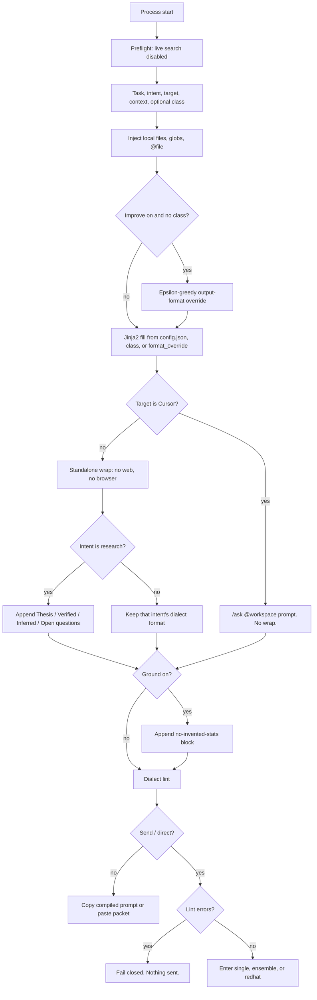
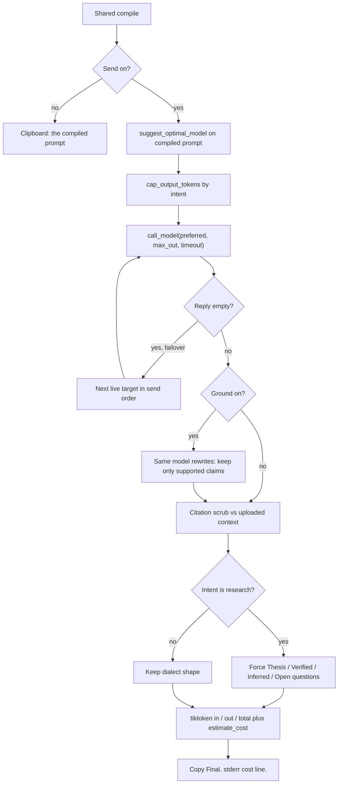
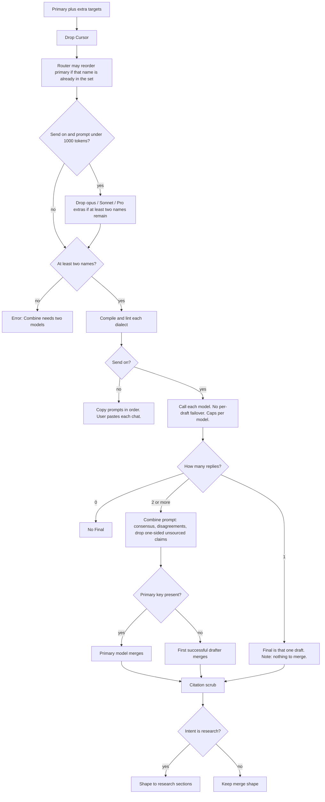
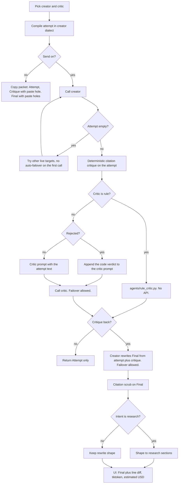
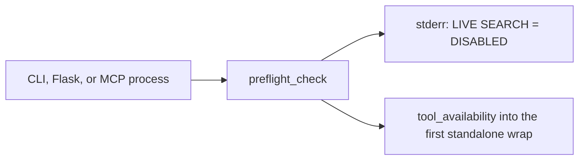

# Assure

Ask one question. Get one answer. The question is rewritten for each model, then checked.

**Current status (2026-09-04).** Assure is **The Intellectual Compiler** — a Document Compiler workbench (PEM engine, package `prompt_matrix`). Marketing at **`/`** on getassureai.com; workspace at **`/app`**; architecture at **`/architecture`**. Branch **`p4-account-wallet`**. Production **`build_sha: 1b21f8b`**, UI `assure-64` / `assure-55` (local uncommitted cache `assure-65` / `assure-56`). Draft model `anthropic/claude-sonnet-4-5`; Gemini `gemini/gemini-3.6-flash`. Live workbench: Projects CRUD, unsaved-change confirms, Audit Manifest on the command deck. Local-only: canvas right-click Edit / Revise / Re-prompt / Send for Revision. Pytest: **291 passed, 1 failed** (`test_resolve_lock_inference_model`). Backup cron still `never_run`. Disk **3.51 GB** free. Full status: `docs/product-status.md`. Source install: `./scripts/install.sh` then `assure --web`. No public installer; `pip install prompt-matrix` is not on PyPI.

The public site on Cloudflare Worker `assure` is live at [https://getassureai.com/](https://getassureai.com/) (HTTPS 200 on 2026-09-01) and [https://assure.orhangorenn.workers.dev](https://assure.orhangorenn.workers.dev), including [Check outputs](https://getassureai.com/hallucination-detection.html). Public NS are `cloe.ns.cloudflare.com` / `milan.ns.cloudflare.com`. `www.getassureai.com` did not resolve. Live HTML still lists canonical `getassure.com` (old `webpage` deploy). There is no public installer. Checklist: `docs/launch-checklist.md`.

Compose is one screen: question first, live compile preview, Auto intent chips, Get my answer. The 3-step tour is gone. Workflow radios, Copy, Ground, and the language switcher stay in the product but are hidden from first-run. Trust badge is Verified / Review needed. Refine this answer replaces thumbs. Nav is Compose, Previous work, Prompt Library, Connect. Landing pricing is Free + Pro ($5, 100 Sends/day). Team remains `--edition team` on this machine, not a store SKU. App CSS `?v=assure-30` (`prompt_matrix/ui_cache.py`). Landing `?v=21`. Local `python -m unittest` count is in the swarm log after the last run.

A Team Compare & Validate Send (Gemini + DeepSeek) on this machine returned a reply, `run_hash`, and quality scores. Compose first paint is translated in en, es, zh, fr, de, ja, tr. Desktop packager exists; `dist/` is empty; download buttons stay disabled.

The header subtitle is "Write your question. Restructured for each AI. Validated. One answer." Combine is the default (several models, one merge). Red-hat is the optional critique loop: attempt, critic, rewrite. One pass. Not a loop until perfect.

Assure is the product name on the local UI and CLI. The compiler underneath is still the Prompt Engineering Matrix (PEM). Install and flags are in `README.md`. If the browser does not open, go to `http://127.0.0.1:8765`.

The page is a light theme, not the old dark brass layout. Tokens live in `static/style.css` `:root`. Trust Blue `#1A4B8C` is headers, selected tabs, primary buttons, and the field focus ring. Confidence Green `#2E7D32` is Send (when Get my answer is on), the word "trust" in the tagline, connected pills, and the answer badge. Warm Gray `#F7F8FA` is the page background. Light Gray `#E2E8F0` is borders. Accent Gold `#D4A843` is the edition chip only. Warnings use Amber `#E8A838`, not bright red. The footer is Deep Navy `#0D2B45`. Body text is `#2D3748`. Face is IBM Plex Sans, mono is IBM Plex Mono. Spacing is an 8px grid (`--spacing-1` is 4px through `--spacing-12` is 48px). Radii: 4 / 8 / 12 / pill. Buttons use `.btn` plus `.btn-primary`, `.btn-success`, `.btn-outline`, or `.btn-sm`. Fields use `.form-control` and `.select-control`. Panels use `.card`. Cache buster on the live sheet is `?v=assure-30` (`ui_cache.APP_CSS`). Markup is `templates/index.html`. `static/index.html` only redirects to `/`. The public landing (`landing/assets/site.css`) uses Vibrant Amber `#FF6B35` for primary CTAs. The workbench does not. Landing cache is `?v=21` (`ui_cache.LANDING_CSS`).

This file is the product overview plus the PEM technical reference. Start at [Product map](#product-map) for every user-facing feature. Developers can skip to [Technical reference](#technical-reference-the-prompt-engineering-matrix-pem).

## Quick start

The workbench stays on this computer. `pip install prompt-matrix` is not on PyPI yet. Do not clone `orhgor/assure` for the app. That repo is the public site (`webpage` branch).

From this repo:

```bash
./scripts/install.sh
source prompt_matrix/.venv/bin/activate
assure --web
```

Windows: `scripts\install.ps1`. Your browser should open. First run: paste a provider key, then write a question. Sign-in is off on this machine unless you set `PEM_HTTP_PASS`. LAN (`--host 0.0.0.0`) requires `--http-pass` and will not start with the old default. Use `assure` for normal usage. `pem` is the same entry point.

Desktop (no public download URL yet):

```bash
./scripts/build-desktop.sh
```

macOS: `dist/Assure.app`. Linux: `dist/Assure/Assure`. Windows: `scripts\build-desktop.ps1`. Double-click after a local build. Do not promise a site download.

Team edition (unlimited Sends on this machine, not a shared workspace): `assure --web --edition team`.

Full flags are in `README.md`. Launch checklist: `docs/launch-checklist.md`.

## What is Assure?

You type a question and usually attach a file. Assure detects what you need, restructures the question for the AI you chose, then checks the answer.

Two modes on Compose (Send is the default; Copy is hidden):

- **Copy the prompt.** Option-click Get my answer, or Cmd/Ctrl+Shift+Enter. The compiled text stays on this machine. You paste it into the model you choose.
- **Send and get my answer.** Assure calls the provider you connected. The question goes only to that API. Keys stay in `prompt_matrix/.env`.

Default Compose workflow is **Compare & Validate**, hidden behind Advanced options. Two or more models draft. One merge keeps what they share, shows fights, and drops one-sided unsourced claims. **Refine this answer** (and Refine & Verify in Advanced) runs attempt, critic, final so you do not copy-paste between chats. **Quick Answer** is a single compile and one reply. The CLI still defaults to `--workflow single` unless you pass `--workflow`.

Do not paste the answer back into this page. Read Final on the right.

PEM has no built-in industry. The case is the file you uploaded and the task you typed.

## Product map

Everything in this tree, grouped by what a person actually does. Names match the UI. Engine ids stay in backticks.

### Compose (the workbench)

Question first at `/`. Live compile preview (`POST /api/preview`, copy-only) updates as you type. Intent is Auto (heuristic in `intent_detector.py`, fallback research). Chips override; ids stay `research | design | comparison | debug | analysis`. Get my answer sends. Copy is Option-click or Cmd/Ctrl+Shift+Enter.

1. **Question.** Task, optional context, optional file. Ground runs when a file is attached (no checkbox). Three example chips fill the box. Recent 3 plus View all → `/history`.
2. **Models.** Pills for Gemini, DeepSeek, Claude, Kimi, Cursor, and a runner closed to the internet. Connected / not connected on each pill. Compare & Validate also shows the extra-model list. If Ollama is connected and no cloud key is, Compose defaults to closed to the internet. Free Combine is two models (Gemini + DeepSeek when both are live). Pro, Team, and Self-hosted go up to eight.
3. **Answer.** Binary badge Verified / Review needed (no % on the badge). Every Send with a reply shows a confidence sentence (`confidence_text` on `/api/render`). Ensemble: models agree on N% and flagged claims. Single model: answer from that model and claims checked against your files. Missing quality: Confidence check pending. Refine this answer re-runs as red-hat. Follow-up chips after a reply fill the question and Send. Token/cost is a hover title on Get my answer.

**Advanced options** (hidden until opened): Quick / Compare / Refine radios, closed to the internet / open to the internet, Save tokens (cheap route), saved class, critic, route notes, Add another model.

**First visit.** No overlay. The live preview is the tutorial. `assure.tour.v1` is unused.

**Right panel.** Empty state shows a mock headline, agreement, disagreement, and checked-against-files (no invented stats). After Send: answer, Verified or Review needed, confidence sentence, Refine this answer. Bandit stays backend (`variation_id` is not shown). Spinner on the button until the request finishes. Pro+ Refine & Verify can show the draft vs final line diff. Free Refine & Verify shows a locked Security critic card.

**Nav.** Compose, Previous work, Usage (signed-in only), Prompt Library (`/library`; Learn is a link on that page), Connect. Language switcher is in the DOM and hidden. Header privacy chip next to the edition chip: closed to the internet, or Connected to Gemini/DeepSeek/Claude/Kimi. Tooltip: Copy stays here. Send goes only to that provider. Header line: Copy stays here. Send goes only to the provider you chose.

### Other pages in the app

| Path | What it is |
| --- | --- |
| `/history` | Previous work on this machine. Search, View, Refine, Export, Delete, clear all. Cards show the question, ready/copy/ground badge, model chips, a clock time, and an answer preview on Pro. Free keeps 7 days of questions. Full answers stay on Pro+. |
| `/learn` | Paste a prompt you already like. No API call. Extracts role, output shape, and a Jinja template. Save as a class. |
| `/library` | Saved classes. Save version, restore, diff. Class export (cursorrules, mdc, fabric, dspy) stays on the API/CLI; the Library UI does not show those buttons. |
| Connect | First run: choose who answers. Paste a key for Claude, Gemini, DeepSeek, or Kimi. Closed to the internet uses a runner on this computer. |
| `/pricing` | Free vs Pro. Pro is $5 per month, 100 Sends/day. Team/self-hosted is `--edition`, not a third SKU. |
| `/privacy` | Copy stays here. Send goes only to the provider you chose. |
| `/terms` | Terms of use. Answers can be wrong. Copy vs Send. No warranty. |
| `/about` | Product copy. |
| `/account` | Cloud account when Clerk + billing env is set. Self-hosted skips cloud login. |
| `/account/usage` | Credit balance, plan, last 10 transactions. Signed-in only. |
| `/signin`, `/signup` | Clerk when `CLERK_PUBLISHABLE_KEY` and `CLERK_SECRET_KEY` are set. Compose stays open until then. |

Header: Assure mark, tagline "Answers you can trust.", Prompt Library nav, hidden language switcher (`en es zh fr de ja tr`), edition chip (Sends left today), privacy line ("Copy stays here. Send goes only to the provider you chose."). Footer: lock plus "Your data stays on your machine. Send only to your chosen provider."

Public marketing site is served from EC2 at **`/`** on [getassureai.com](https://getassureai.com); workspace at **`/app`**. **`p4-account-wallet`** → EC2 JDF Workstation. **`webpage`** → optional Cloudflare Worker `assure` on workers.dev only (`npx wrangler deploy`). Workers Builds must watch **`webpage` only**; a failing **Workers Builds: assure** check on an app PR is branch misconfiguration — see `docs/cloudflare-fix.md`.

Landing hero is prompt-first: you ask vaguely, Assure writes the prompt for the AI you chose, then it checks the answer. Landing steps are type a question, watch the live preview, Get my answer. FAQ: not a chatbot; you do not pick Quick / Validated / Refined first. Three hero personas (Sovereign Analyst, Privacy-First Researcher, Prompt Reluctant Professional). Who Assure is for: six jobs (consultant, academic researcher, policy analyst, technical writer, marketing strategist, compliance officer). Check outputs page is live on the Worker: `hallucination-detection.html` (Check against my files, Compare & Validate, Copy vs Send). Install copy is “The app opens,” not admin/changeme. No TAM stats. No fake customer logos. Download OS buttons stay disabled until `data-download-*` has a real URL. There is no public installer. Landing CSS/JS cache `?v=21`. Trust row: local-first, you pick the provider, no vendor lock-in. Pricing: Free + Pro $5. Unlimited Sends on this machine is `ASSURE_EDITION=team`, not a third plan. No Contact Sales. Terms `landing/terms.html` and app `/terms`. ICP `landing/ICP.md`. Objections `landing/objections.md`. Use cases `landing/use-cases/` (consultant, researcher, analyst). Audit `landing/audit.html` (live as `audit.html`). Product Hunt draft `landing/PRODUCT_HUNT.md`. Launch checklist `docs/launch-checklist.md`.

### Copy vs Send

| | Copy the prompt | Send and get my answer |
| --- | --- | --- |
| Where the question goes | Stays on this computer | The provider you chose |
| What you see | Compiled prompt to paste | Verified answer on the right |
| Counts as a daily Send | No | Yes (Free 10, Pro 100, Team and Self-hosted unlimited) |
| Refine, confidence, tokens | No | Yes, after a reply (tokens on hover) |

Closed to the internet vs open to the internet is a separate choice (Advanced). It is not the Copy/Send pair. Do not call Copy "offline."

### Trust and quality

- Citation pass after every live reply: dates, percents, and publication names not in the upload become `Data not available in current context`.
- Research answers are forced into Thesis / Verified / Inferred / Open questions.
- Confidence sentence on every Send with a reply: draft-overlap percent (word overlap, not a judge) and flagged citation count. Badge is Verified / Review needed with no numbers. Field: `confidence_text`.
- `score_run` fills `result.quality` on every Send even if the bandit is off.
- Refine this answer posts rating 0 then re-runs as red-hat. Epsilon-greedy format pick on the next compile when improve is on and there is no class. No `variation_id` in the UI.
- `--redteam`: local detector for injection phrasing, PII-shaped spans, and citation-like lines. No extra model call. Not an exploit kit.
- `--critic rule`: local structural critic. No second model.

### Editions (what changes)

| | Free | Pro |
| --- | --- | --- |
| Sends per UTC day | 10 | 100 |
| Models per Compare | 2 | up to 8 |
| History | 7 days | Full, no prune |
| History export | Plain text | Markdown, HTML, Prompty, PDF |
| Class export | Blocked | cursorrules, mdc, fabric, dspy (CLI/API; Compose hides the buttons) |
| Draft vs final diff | Hidden | Shown |
| Critic personas | `redhat` | All five |

Team and Self-hosted are available via `--edition team` / `--edition self-hosted` for unlimited Sends on your machine. Not a store SKU. The four-column table for developers is under **Editions** below.

Gates are env flags (`ASSURE_EDITION` / `PEM_EDITION` / `--edition`). There is no license server in this tree. Shared workspaces are not in this repo. Pro price on `/pricing` is $5/mo.

### Developer surfaces

| Surface | What it runs |
| --- | --- |
| CLI `assure` / `pem` | Copy, Send (`--direct`), lint, export, cheap, local (`--local` = closed to the internet), class, history store |
| `pem eval --dataset` | Batch JSON cases. Compile-only unless `--direct`. Accuracy from `expect_contains`. Safety from red-team. Quality from `score_run`. Sample: `examples/eval_sample.json` |
| `pem --ci` | One JSON object (prompt, reply, quality, lint, redteam). Exit 1 on lint or red-team errors. Skips the clipboard so GitHub Actions does not need xclip |
| `pem monitor` | Usage from `history.sqlite` (`--show-cost`, `--show-success-rate`, `--json`). Latency is not stored |
| `pem mcp` | stdio MCP: compile, combine, critique_rewrite, dialect_lint, export, swarm_develop |
| Flask HTTP | Compose and the pages above. `POST /api/render` is Send/Copy. Read-only `GET /api/prompts` and `GET /api/prompts/<id>` |
| GitHub Actions | `.github/workflows/ci.yml` runs `python -m unittest`, `pem --ci gemini analysis "Summarize" --copy` (compile only, no clipboard), and `pem eval --dataset prompt_matrix/examples/eval_sample.json` |
| Python | `load_matrix()`, `render_prompt()`, `execute()`, `run_workflow()` |
| Swarm | MCP `swarm_develop` after Cursor lists the pem tools. Do not CLI-swarm a verify job against landed code. `--edition team` for unlimited Sends on this machine when Pro's daily cap is hit. Logs: `README_SWARM.md`. Apply complete diffs. HTML dumps have truncated |
| Desktop | `scripts/build-desktop.sh` / `packaging/assure.spec`. `.github/workflows/desktop.yml` builds artifacts. Not published from `orhgor/assure` |
| Package | `pyproject.toml` 0.1.0, scripts `assure` / `pem` / `prompt-matrix`. `pip install prompt-matrix` is not on PyPI yet |

### HTTP API (workbench)

Auth: sign-in is off on this machine unless you set a password. LAN (`--host 0.0.0.0`) requires one and will not start with the old default. When HTTP Basic is on, every path except `GET /api/health` and `GET /api/status` uses it. Clerk, when configured, also leaves those two plus auth and the Stripe webhook open.

| Method | Path | Notes |
| --- | --- | --- |
| GET | `/api/health` | Library smoke test. No auth |
| GET | `/api/status` | Connected providers and live route. No auth |
| GET | `/api/settings` | Decrypted cloud API keys + preferences. Never writes keys to disk |
| POST | `/api/settings` | Encrypt keys and upsert `user_settings` |
| GET | `/account/usage`, `/api/usage` | Credit balance, tier, last 10 transactions |
| GET | `/api/catalog` | Targets, intents, personas (locked included), edition snapshot |
| GET | `/api/i18n` | UI catalog for `?lang=` |
| POST | `/api/keys` | Write one provider key into `.env` |
| POST | `/api/intent` | Heuristic intent id. Fallback research |
| POST | `/api/preview` | Compile-only prompt preview. Does not count as a Send |
| POST | `/api/render` | Compile and optional Send. Returns `reply`, `run_hash`, `quality`, tokens, cost |
| POST | `/api/feedback` | `run_hash` + rating 1 or 0. One per run |
| GET | `/api/history` | Grouped previous work. `full` depends on edition |
| GET | `/api/history/diff` | Unified diff of two stored replies. `?left=` and `?right=` run hashes |
| GET | `/api/history/<id>` | One item. Answer body on Pro+ |
| GET | `/api/history/<id>/export` | `?format=` markdown, html, prompty, pdf, plain |
| DELETE | `/api/history/<id>` and `/api/history` | One or all |
| GET | `/api/library` | Classes and saved prompts |
| POST | `/api/library/classes`, `/api/library/prompts` | Create |
| POST | `/api/library/classes/<id>/versions` | Snapshot |
| POST | `/api/library/classes/<id>/rollback` | Restore version `n` |
| GET | `/api/library/classes/<id>/diff` | Unified diff `?a=&b=` |
| GET | `/api/prompts`, `/api/prompts/<id>` | Read-only saved prompts |
| POST | `/api/learn` | Extract a class from pasted text |
| POST | `/api/copy` | Clipboard helper |
| POST | `/api/export` | Class export (blocked on Free) |
| GET/POST | `/api/auth/*`, `/api/billing/*`, `/api/account/*` | Clerk + Stripe test mode when env is set |

There is no `/api/generate` or `/api/compile`. Compose Send posts to `/api/render`. Live preview uses `/api/preview`.

## Privacy by design

Standalone compile and Copy do not search the web, open a browser, or scrape pages. Preflight prints that live search is disabled and injects that into the first system wrap.

Send is the exception you opt into. The prompt goes to Anthropic, Google, DeepSeek, Moonshot, or a local OpenAI-compatible server, depending on the key or runner you attached. Assure does not add a second cloud of its own.

History is opt-in (`PEM_ENABLE_HISTORY`). Full prompt bodies need `--store-prompts` / `PEM_STORE_PROMPTS`, or a paid edition that forces store after a successful Send. SQLite stays on this disk (`history.sqlite`). Keys are gitignored.

The citation pass is a second filter, not omniscience. A model can still be wrong about facts that are not dates, percents, or named publications.

This Cursor chat may search. Compiled prompts sent to Gemini, DeepSeek, Claude, Kimi, or Ollama may not. Do not expect a standalone run to know last week's news.

## For people who do not want the engine internals

| You need | What Assure does |
| --- | --- |
| Ask a question | Type it. Assure detects what you need (Auto intent). Attach a file if you have one. |
| Know it's trustworthy | Compare & Validate runs two models. The badge says Verified or Review needed. A confidence sentence tells you where models agree and what was flagged. |
| Catch invented stats | Citation scrub strips dates, percentages, and publication names not in your file. Research answers are forced into Thesis / Verified / Inferred / Open questions. |
| Stress-test a draft | Click Refine this answer. It runs attempt, critic, final automatically. |
| Keep it private | Copy the prompt with Option+Click (no API call). Or run closed to the internet with a local model. |
| Reuse a good prompt | Save it in the Prompt Library. Pro+ can export to `.cursorrules` or Fabric from the CLI/API. |
| See what changed | Previous work keeps your last 7 days (Free) or forever (Pro). |
| Spend less | Save tokens (cheap route) picks the most efficient model. |
| Batch or CI | `pem eval --dataset` and `pem --ci` for developers. |

## Editions

Gates live in `editions.py`. Default is Free. Stripe test checkout and Clerk login exist when those keys are in `.env`. They are optional. `--edition` still raises the cap on this machine without them.

Set `ASSURE_EDITION` or `PEM_EDITION`, `config.json` `runtime.edition`, or `--edition`. Values: `free`, `pro`, `team`, `self-hosted`.

```bash
assure --web
assure --web --edition pro
ASSURE_EDITION=self-hosted assure --web
```

| Gate | Free | Pro | Team | Self-hosted |
| --- | --- | --- | --- | --- |
| Sends per UTC day | 10 | 100 | Unlimited | Unlimited |
| Models per Combine | 2 | up to 8 | up to 8 | up to 8 |
| History | hashes, prune after 7 days | full prompt bodies | full prompt bodies | full prompt bodies |
| History work export | plain text | markdown, html, prompty, pdf | same | same |
| Class export | blocked | cursorrules, mdc, fabric, dspy | same | same |
| Red-hat line diff | hidden | shown | shown | shown |
| Critic personas | `redhat` | all five | all five | all five |
| Rule critic | yes | yes | yes | yes |
| Sign-in on the UI | off on this machine; required on LAN | same | same | same |

Not in this tree: shareable links, shared workspaces, OpenTelemetry, RBAC, priority support. Batch eval, `--ci`, `pem monitor`, and `--redteam` are in this tree. Previous work on Pro+ can export markdown, HTML, Prompty, or a simple PDF. Class export is still cursorrules / mdc / fabric / dspy.

Live UI `/pricing` in this repo: Pro is $5 per month in Stripe test mode. An older product brief listed Pro $9/mo, Team $29/mo, Self-hosted $199 one-time. Those brief figures were not collected here. Until you put Stripe keys in `.env`, `--edition pro` (or `team` / `self-hosted`) still raises the cap on this machine. Paid licenses are not issued from this app without those keys.

# Technical reference: the Prompt Engineering Matrix (PEM)

PEM is a local prompt compiler and optional multi-model runner. You give it a vague task, an intent, and usually a file. It writes a prompt in the dialect of Claude, Gemini, DeepSeek, Kimi, a local model, or Cursor, then either copies that prompt or sends it.

It does not replace Fabric, the `llm` CLI, or Cursor chat. Those tools run prompts. PEM shapes them, can call more than one model, and can refuse to invent facts that were never in the upload.

The package lives in this repo as `prompt_matrix`. Use `assure` for normal usage. `pem` and `python -m prompt_matrix` are the same entry point and still work. Flask `use_reloader` is off, so restart after Python edits.

## What a run does

1. You pick a target AI and an intent (`research`, `design`, `comparison`, `debug`, `analysis`). There is no `code` intent.
2. `config.json` supplies that model's Jinja2 template, the intent's role plus output shape, and optional `runtime` defaults (`max_tokens` 4096, `timeout_seconds` 60, `store_prompts` false, `auth_user` admin, `edition` free, `improve.enabled` true / `epsilon` 0.2). Passwords do not belong in that file.
3. File paths, globs, and `@file` tokens in the task or context get read into the prompt (per-file cap 200 KB, 20 files, 500 KB total).
4. For every standalone target except Cursor, PEM prepends execution rules. Live web search is off. Browser is off. The model may use the uploaded file and its training cutoff.
5. Copy mode puts the prompt on the clipboard. Send / `--direct` calls LiteLLM through `litellm_runner.py` (`stream=False`). Hard caps: `PEM_MAX_TOKENS` (default 4096) and `PEM_TIMEOUT_SECONDS` (default 60). `cost_router.cap_output_tokens` may tighten the output cap by intent (flash/haiku also cap at 1024). A red-hat Send also caps the whole attempt, critique, final loop at `PEM_WORKFLOW_TIMEOUT` (default 120). Timeouts and context-window overflows return an error string instead of hanging. Send fails closed if the dialect linter finds errors. Free/Pro daily Send caps run in `editions.guard_send` before the call.
6. After a live reply, tiktoken counts input, output, and total (`cl100k_base` if the model name is unknown). `estimate_cost` writes a USD estimate from the static table in `cost_router.py` (not a live vendor quote). stderr gets `[Cost Router] Estimated cost: $... for ...`. The UI shows `N in + N out = N tokens (~$... est.)`.
7. Cursor has no public chat API. PEM compiles `/ask @workspace` for paste, or you call PEM from a Cursor agent through MCP.

On process start, standalone PEM prints that live search is disabled and injects that fact into the first system wrap.

CLI flags override `config.json` runtime, which fills env only when the matching variable is unset: `--store-prompts` → `PEM_STORE_PROMPTS`, `--max-tokens` → `PEM_MAX_TOKENS`, `--timeout` → `PEM_TIMEOUT_SECONDS`, `--auth-user` / `--auth-pass` → `PEM_HTTP_USER` / `PEM_HTTP_PASS`, `--critic rule` → `PEM_CRITIC_MODE=rule`, `--cheap` → `PEM_COST_ROUTE`, `--edition` → `ASSURE_EDITION`. `--model` / `PEM_MODEL` wins over cheap routing.

## Feature set

### Dialect compiler

Each target gets a real template, not a string `replace()`:

| Target | Dialect |
| --- | --- |
| Claude | XML `<role>`, `<instructions>`, `<thinking>` |
| Gemini | Plain role/task plus a "Data not available" grounding line |
| DeepSeek | Markdown with `## System Prompt`, `## User Request`, self-correction checklist |
| Kimi | Long-context markdown, tables, answer in the user's language |
| Local (`ollama` id) | Direct markdown. No external API calls from the model |
| Cursor | `/ask @workspace`, code-only output |

Edit `config.json` to change a dialect. `pem --list` prints the loaded targets and intents.

### Intents

Intents set role and output shape. They are not domains. UI hints are plain English (`INTENT_PLAIN` in `editions.py`).

| Intent | What the compiled prompt asks for | Plain hint (EN) |
| --- | --- | --- |
| `research` | Thesis, verified findings from the upload, inferred gaps, open questions | Research: Get a structured analysis with evidence. |
| `design` | Goals, constraints, proposed design, tradeoffs, one next step | Design: Create a plan or blueprint. |
| `comparison` | Table, recommendation, what would change the call | Comparison: Decide between options with pros and cons. |
| `debug` | Ranked hypotheses, how to confirm each, first command or code change | Debug: Identify and fix a problem. |
| `analysis` | Method, results, limits, what the numbers do not prove | Analysis: Understand the numbers and what they mean. |

The research four-part layout is research only. Other intents keep their own format. After Send, a citation scrub still strips invented dates, percentages, and named publications that were not in the upload. Only research gets forced into Thesis / Verified / Inferred / Open questions.

### Workflows

**Single.** One model, one compiled prompt, one reply. Right before LiteLLM, `suggest_optimal_model(compiled_prompt, intent, user_preference=target_model)` picks a pricing-table key (the selected target or `--model` still wins). That id plus `cap_output_tokens` go into `call_model`.

**Ensemble (Combine).** Two or more models draft. One merge pass keeps consensus, shows disagreement, and drops one-sided unsourced claims. Default pair in MCP is Gemini then DeepSeek. Free clamps extras to one other model (`FREE_ENSEMBLE`). Cursor is compile-only, so it is skipped as a Combine draft target. The cost router may reorder the primary to a member already in the set. On Send, extras that are a bad fit for a short prompt (under 1000 tokens) can be dropped: anything with `opus` in the id, plus Sonnet / Gemini Pro extras. PEM will not shrink the set below two models.

**Red-hat.** Attempt, then a critic that does not write a new essay, then a final rewrite. Personas:

| Id | Critic job | Edition |
| --- | --- | --- |
| `redhat` | Unsupported claims, missing caveats, keep / revise / reject, confidence 0-5 | Free and up |
| `security` | Ambiguity, injection, edge cases, invented APIs or credentials | Pro+ |
| `tokens` | Cut repetition, keep constraints | Pro+ |
| `schema` | Exact JSON / XML / regex shape, no preamble | Pro+ |
| `code` | Logic, bounds, first command or test to try | Pro+ |

Same-model critic is allowed only when both sides are the local `ollama` target. `--critic rule` or `PEM_CRITIC_MODE=rule` skips the LLM critic and runs `agents/rule_critic.py` locally (conflicting roles, tone, word limits vs examples, undeclared Jinja names). No second model and no API key. Attempt and final still need a reachable model if Send is on.

Send-off red-hat returns three paste packets. Send-on runs all three calls. If Ollama is down, Send hops to a connected cloud key instead of dumping paste kits.

Optional **Ground** checkbox (and MCP `ground`) appends the no-invented-stats instruction and, on Send, a second rewrite that keeps only claims supported by the task or context.

### Improve loop (local)

PEM can swap the intent **output-format** string before Jinja compile, then score the Send. It does not replace the dialect compiler. There is no `config.json` `variations` list, no `variation_text.format(task=task)`, and no `random.choice`. A saved class (`class_id`) still wins over the bandit.

`config.json` `runtime.improve` defaults: `enabled` true, `epsilon` 0.2, `generate_with_model` false. `PEM_IMPROVE=0` turns the loop off. `PEM_IMPROVE=1` forces it on.

**Pick (before compile).** If improve is on and there is no `class_id`, `template_library.pick_variation` loads four local seed formats per intent (`variation_generator.seed_texts`) into `prompt_variations`, then epsilon-greedy (`bandit.py`) picks one. That string is `format_override` in `render_prompt_detailed`. `PEM_GENERATE_VARIATIONS=1` (or `improve.generate_with_model`) can add model-written formats **once per intent**. That is one extra Send, not several per question.

**Score (after a successful Send).** `run_hash` is sha256 of the compiled prompt, first 16 hex chars. It goes on `PipelineResult` and `/api/render`. `quality.score_run` writes consensus, coherence, hallucination rate, token efficiency, and `overall_score`. `record_outcome` bumps `usage_count` and rolls `performance_score`. `record_performance` always inserts a `prompt_performance` row on Send (quality columns stay null if improve is off). stderr: `[Improve] overall=... variation=...`.

| Metric | What it is |
| --- | --- |
| Consensus | Jaccard overlap of ensemble draft replies. One-model runs leave this empty. Word overlap, not a judge model. |
| Coherence | Headings, lists, length, and `rule_critic` findings. Not a Gemini Flash judge. `PEM_QUALITY_JUDGE` is reserved and does not fire a hidden Send. |
| Hallucination rate | Flagged citation-scrubber lines over claim sentences. "Data not available" is not a claim. |
| Token efficiency | Combined quality per 400 tokens, capped at 1. |

**Feedback (Compose).** After Send with a reply, Refine this answer sits under the answer. It posts rating 0 then re-runs as red-hat. Thumbs are not on the page. Copy-only does not show the button. `POST /api/feedback` JSON: `run_hash`, `rating` (`1` or `0`), optional `variation_id`. `apply_feedback` looks up `prompt_performance` by `run_hash`. A second rating on the same run returns `{already: true}` and does not change the score. It does not increment `usage_count`. Score is clamped to `[0, 1]`.

| Signal | Delta on `performance_score` |
| --- | --- |
| Helpful | +0.15 |
| Not helpful | -0.15 |
| `hallucination_rate == 0` | +0.05 |
| `total_tokens < 1500` | +0.05 |
| `total_tokens > 3000` | -0.05 |

If the performance row has no token count, PEM reads `executions.total_tokens` where `prompt_hash` equals `run_hash`. Each rating prints `[Improve] feedback=helpful|not variation=...` to stderr. `PEM_IMPROVE_SUMMARY=1` then prints `get_best_variations` rows with `usage_count >= 10`. Scores stay in this machine's `history.sqlite`. They are not shared across users and they do not rewrite `config.json`.

### Tokens

`token_counter.count_tokens` uses tiktoken. Unknown LiteLLM ids fall back to `cl100k_base`. The old chars/4 guess is gone. Counts land on the pipeline result, `/api/render`, the Compose token line, history, and MCP text.

### Cost router

`cost_router.py` holds a static USD-per-1M-token table. Refresh that dict when you care about accuracy. It is not a live vendor API.

- `estimate_cost` after every Send. Local / Ollama is `$0` in that table.
- `cap_output_tokens` by intent: debug 512, comparison 1024, design 1536, analysis 2048, research 4096, then min 1024 for flash/haiku. Swarm **developer** raises that floor to 16384 (timeout 180s) so HTML dumps are not cut. Other swarm roles keep the intent cap.
- `--cheap` / `PEM_COST_ROUTE=1` / Compose **Cheap route** may switch the live cloud target before compile so the dialect matches. `--model` and `--local` skip that switch. If the preferred provider is down, PEM walks the table for the next cheapest live target.
- Rules of thumb in the table: tiny debug/comparison → Gemini flash, medium analysis/design → DeepSeek, research → Haiku then Sonnet on very long prompts.
- Live Gemini Send ids (2026-08-31): pricing keys `gemini-1.5-pro` / `gemini-1.5-flash` still exist in the table. `send_model_id` maps them to `gemini/gemini-3.5-flash` and `gemini/gemini-3.5-flash-lite`. Retired `gemini-1.5-*` and quota-blocked `gemini-3.6-flash` rewrite to those ids.

### Caps and timeouts

| Knob | Default | Where |
| --- | --- | --- |
| `PEM_MAX_TOKENS` / `--max-tokens` | 4096 | each LiteLLM completion |
| `PEM_TIMEOUT_SECONDS` / `--timeout` | 60 | each LiteLLM completion |
| `cost_router.cap_output_tokens` | by intent | min()'d with max tokens |
| `PEM_WORKFLOW_TIMEOUT` | 120 | full red-hat Send loop (`workflow_cap.py`). SIGALRM on the main thread, a timer in Flask threads |
| `ASSURE_EDITION` daily Sends | 10 on Free, 100 on Pro | `guard_send` before a live Send |

A timeout reply looks like `ERROR: Run aborted due to timeout (60s).` A context overflow looks like `ERROR: Prompt exceeds model's context window.` A loop abort looks like `ERROR: Full workflow timeout. Increase PEM_WORKFLOW_TIMEOUT.` A quota miss looks like `Free allows 10 Sends per day.`

### Auth

On `127.0.0.1`, the UI has no sign-in unless `PEM_HTTP_PASS` (or `--http-pass`) is set to something other than the old default. Binding to `0.0.0.0` requires a password and refuses to start with the default. When sign-in is on, HTTP Basic covers every path except `GET /api/health` and `GET /api/status`. Credentials from `PEM_HTTP_USER` / `PEM_HTTP_PASS` in `.env`, or `--auth-user` / `--auth-pass`. Do not commit the password. `config.json` `runtime.auth_user` may set the username. The password stays in env or the flag.

Optional cloud login: Clerk when `CLERK_PUBLISHABLE_KEY` and `CLERK_SECRET_KEY` are set (`/signin`, `/signup`). Self-hosted and source-install without a publishable key skip it. Stripe test checkout uses `STRIPE_SECRET_KEY` / `STRIPE_PRICE_ID`. Supabase stores email, tier, credit counts, and Fernet-encrypted API keys. Never prompt text. CLI (`pem` without `--web`) never requires login.

### Grounding (standalone)

Standalone Gemini, DeepSeek, Claude, Kimi, and local calls have no web and no browser.

- Recent Google results or current market data must start with `Live search unavailable in standalone PEM.`
- Invented dates, percentages, and publication names are banned unless they appear in the uploaded file.
- Gaps are `Data not available in this context.` or `Data not available.`
- Citations in this Cursor chat (when you use live search here) are labeled uploaded file, web search, or model inference. Do not mix inference with the other two.

### Surfaces

**Web UI.** `assure --web` starts the app and should open the browser. If it does not, go to `http://127.0.0.1:8765`. Sign-in is off on this machine unless you set `--http-pass` / `PEM_HTTP_PASS`. Sharing on the LAN: `pem --web --host 0.0.0.0 --http-pass PASS` (refuses the old default). Live markup is `templates/index.html` (Jinja `gettext`). `static/style.css?v=assure-30` is the design-token sheet (`ui_cache.APP_CSS`). Compose hero title (`A trusted answer starts with the right question.`) stays one line from 841px up (no `max-width: 28rem` on that h1). Header: SVG checkmark mark (not an emoji), **Assure**, tagline "Answers you can trust." with "trust" in Confidence Green, Prompt Library instead of Learn/Classes, hidden language switcher (en, es, zh, fr, de, ja, tr), privacy chip (closed to the internet / Connected to the chosen provider), edition chip. Copy stays on this machine. Send uses the provider you connect. There is no "data never leaves your machine" claim, because Send does leave. The chip does not say web search is on.

Compose is one screen. Question, live preview, Get my answer. Model pills stay visible. Workflow radios, Copy radios, Ground, cheap, class, and closed/open sit behind Advanced options. No tour overlay. Internal workflow ids stay `single` / `ensemble` / `redhat`. Default workflow is Compare & Validate (`ensemble`). Intent chips use Auto plus `INTENT_PLAIN` labels. Target pills show connected / not connected. Copy vs Send does not use the word offline.

Right panel: answer, Verified or Review needed, confidence sentence (`confidence_text`), Refine this answer after a Send with a reply. Follow-up chips are hardcoded per intent (Option A). Click fills the question and Sends. During Send, `#run-busy` plus `.spinner` show until `setBusy(false)` in the submit `finally` block. `POST /api/feedback` needs `run_hash` from the last `/api/render`. `/api/render` also returns `variation_id`, `quality`, `confidence_text`, `models`, `run_hash`, `input_tokens`, `output_tokens`, `total_tokens`, `estimated_cost`. The UI does not show `variation_id`.

Previous work tab lists Sends on this machine (View, Refine, Export, Delete, search). A successful Send writes an `executions` metadata row even when `PEM_ENABLE_HISTORY` is off. Free keeps 7 days of questions and counts. Export on Free is plain text. Pro+ can export markdown, HTML, Prompty, or a simple PDF from that dialog (no WeasyPrint). Class export stays on CLI/`POST /api/export`. The Library page does not show those buttons.

Locale comes from `?lang=`, the Flask session, the `assure_lang` cookie, then `Accept-Language`. Dynamic strings load from `/api/i18n` (`i18n.py` plus `translations/*/LC_MESSAGES/`). There is no `/api/generate` or `/api/compile`. Compose Send posts to `/api/render`. Preview posts to `/api/preview`.

Connect, Learn, Prompt Library, History, Pricing, Privacy, About, and Account are listed in [Product map](#product-map). Free quota uses the upgrade banner and `/pricing`. Pro features that are locked on Free show 🔒 and `upgrade.unlock`.

**CLI.** Use `assure` for normal usage. `pem`, `python -m prompt_matrix`, and `python cli.py` are the same entry point. Copy, print, lint, export, `--direct`, `--workflow`, `--local` (closed to the internet), `--class-id`, `--store-prompts`, `--max-tokens`, `--timeout`, `--cheap`, `--critic rule`, `--persona`, `--extra`, `--edition`, `--auth-user` / `--auth-pass`, `--ci`, `--redteam`, `--history`. Subcommands: `eval`, `monitor`, `mcp`, `web` / `serve`. CLI default workflow is `single`. Compose default is `ensemble`.

```bash
pem eval --dataset prompt_matrix/examples/eval_sample.json
pem eval --dataset cases.json --direct
pem gemini analysis "Check the notes" --direct --ci --redteam
pem monitor --show-cost --show-success-rate
pem monitor --json --days 30
```

**Eval.** `eval_run.py`. Dataset is JSON with a `cases` array (or a top-level list). Each case needs `task`. Optional `intent`, `target`, `context`, `class_id`, `workflow`, `ground`, `expect_contains`. Compile-only unless `--direct`. `--direct` Sends each case and counts toward the edition quota. Accuracy is 1.0 only when every `expect_contains` needle appears. Safety comes from `agents/redteam.py`. Quality from `quality.score_run` when a reply exists.

**CI JSON.** `--ci` prints one object: `ok`, prompt, reply, quality, tokens, lint, redteam, `run_hash`. Exit 1 if lint has errors or red-team `ok` is false. If quality is missing and there is a reply, CLI still runs `score_run`. `--ci` does not write the clipboard.

**Monitor.** `usage_summary()` over `history.sqlite`. Per-model runs, Sends with a reply, optional estimated USD, tokens, reply rate. `--show-latency` prints that latency is not stored.

**MCP.** `pem mcp` over stdio (`python -m prompt_matrix.mcp_server` is the same). Cursor `~/.cursor/mcp.json` uses `-m prompt_matrix.mcp_server`. Stdio replies are newline-delimited JSON (not LSP Content-Length). Boot does not print the live-search preflight. Tools: `pem_compile`, `pem_combine`, `pem_critique_rewrite`, `pem_dialect_lint`, `pem_export`, `swarm_start`, `swarm_status`, `swarm_develop`, `pem_apply_diff`. Cursor hides the name `apply_patch`. There is no `pem mcp <tool>` CLI. Keys stay in `prompt_matrix/.env`. Never print them. Cost logs still go to stderr after a tool call. `target_ai: cursor` is compile-only. `swarm_start` runs `run_swarm()` on a worker thread; poll `swarm_status`. Cursor times out a blocking full pipeline. MCP writes accepted files after lint (`apply_workspace`). Do not `alwaysAllow` `swarm_start` or `swarm_develop`. Reload MCP after changing `mcp.json` or `mcp_server.py`.

**Python.** `load_matrix()`, `render_prompt()`, `execute()`, `run_workflow()` without the CLI.

### Library and export

Learn structure extracts role, output format, and a Jinja template from a prompt you already like. No API call. Save as a class in `library.json`. A class can override role, format, or the whole template. Classes pane can **Save version** (`snapshot_class`), **Restore** (`rollback_class`), and show a unified diff (`class_version_diff`). APIs: `POST /api/library/classes/<id>/versions`, `/rollback`, `GET .../diff?a=&b=`.

Export a class as `.cursorrules`, `.mdc`, Fabric-style `system.md` / `user.md`, or a DSPy signature stub. Free raises `MatrixError`. No Fabric or DSPy SDK is installed. The export is text you paste elsewhere.

Opt-in history (`PEM_ENABLE_HISTORY=1` or `--history`) writes hashes, character counts, and tiktoken input / output / total to `executions` in `history.sqlite`. A successful Send also writes that metadata row so Previous work is not empty on Free. Full prompt bodies need `--store-prompts` / `PEM_STORE_PROMPTS=1`, or a paid edition that forces store after Send (`run_hash` is sha256 of the compiled prompt, first 16 hex chars, UNIQUE replace). Free prunes `executions` older than 7 days. `PEM_ENABLE_HISTORY` and `PEM_STORE_PROMPTS` are off by default. Improve tables `prompt_variations` and `prompt_performance` live in the same SQLite file.

### Routing when Send is on

Order: local runner first, then Gemini, DeepSeek, Claude, Kimi.

The local target id is `ollama`. If Ollama is installed, PEM can start `ollama serve`. If vLLM (`:8000`), SGLang (`:30000`), Llamafile (`:8080`), or LM Studio (`:1234`) is already up, that OpenAI-compatible server wins over Ollama. Weights are independent of the runner. Override with `--model`, `PEM_MODEL`, `PEM_LOCAL_MODEL`, or `PEM_OLLAMA_MODEL`.

`--cheap` may change the cloud target using `cost_router.suggest_live_target` before compile. After compile, single Send still runs `suggest_optimal_model` on the compiled prompt and passes that LiteLLM id plus `max_out` into `call_model`.

Cursor is never a live Send target.

### Dialect lint

Before Send, PEM checks the compiled text:

- Claude: required `<role>` and `<instructions>`, balanced tags
- Cursor: `/ask` required; warns if no `@workspace` or `@file`
- DeepSeek: `## System Prompt` and `## User Request` required
- Gemini: warns if the grounding line or Role is missing
- Kimi / local: `## Task` required

Copy-only still works on a lint error. Direct send does not.

## Swarm development log

Append a row here when a swarm (or a follow-up patch from one) finishes. Newest last. Do not treat a Keep on already-shipped code as a claim that the feature was missing.

How to run the next task: Cursor MCP `pem` lists `swarm_develop`. Call that tool. Do not `python -m prompt_matrix.swarm` as a fallback. Do not `alwaysAllow` `swarm_develop`. P2.3 helpers, P4 credit wallet, and the waitlist API are on this branch. Details: `README_SWARM.md`.

| When | Task | Run | Verdict | What landed |
| --- | --- | --- | --- | --- |
| 2026-08-31 | Refresh PEM.md for current status | manual | n/a | Overview now states launch status: workbench source-install ready, Worker Check outputs 200, getassure.com pending NS, no public installer, Team Send probed, 7-locale first paint, unittest 65 ok, public launch no-go. Auth start copy is `assure --web`, not admin/changeme. File tree lists `docs/launch-checklist.md`. |
| 2026-08-31 | P0 launch fixes | Cursor, not swarm | n/a | Pushed `webpage` `c93b365` / `9d48c07`. Live `hallucination-detection.html` 200. Team ensemble Send `run_hash` 2403c4dd7b52dda6. Flask restart; 7-locale Compose first paint. `getassure.com` zone pending; NS still Namecheap. Checklist updated. No-go on the public domain. |
| 2026-08-31 | Professional first-run | Cursor, not swarm | n/a | Loopback has no sign-in unless a password is set. LAN refuses the old default password. `assure --web` copy is “browser should open / paste a key,” not admin/changeme. Connect lead in all seven locales. |
| 2026-08-31 | Pre-launch testing checklist | Cursor, not swarm | n/a | `docs/launch-checklist.md` with section checkboxes and go/no-go. Swarm skipped (Pro cap; HTML dumps truncated). Verdict: public launch no-go. Local unittest 64 ok, `pem --ci` and eval exit 0, health/Basic Auth green. Live Worker 404 on `hallucination-detection.html`. Desktop `dist/` not built. |
| 2026-08-31 | Gemini / DeepSeek Send ids | live probe | n/a | Gemini 1.5-pro 404s on v1beta. `gemini-3.6-flash` 429s on this key. Sends now go to `gemini/gemini-3.5-flash` (architect / Pro alias) and `gemini/gemini-3.5-flash-lite` (tester / cheap). DeepSeek `deepseek/deepseek-chat` returned pong after a balance top-up. |
| 2026-08-31 | Task 1. Thumbs on existing feedback | `c4b60d0c6f94108f` | Revise (0.20) | Swarm wrote only `tests/test_feedback.py`. Patch not applied. Follow-up in tree: 👍/👎 on `#feedback-yes` / `#feedback-no`, `feedback.yes_aria` / `feedback.no_aria` in all seven catalogs, `data-i18n-aria`. `POST /api/feedback` unchanged. |
| 2026-08-31 | Task 2. Spinner on Get my answer | `1375bb0a35d78da7` | Keep (0.40) | Already in tree: `#run-busy`, `.spinner`, `setBusy()` on submit, `finally` clears it, `#go.is-busy` on the button. Swarm patch empty. No file change. |
| 2026-08-31 | Task 1 follow-up. Exact thumbs markup | manual | n/a | `#feedback-yes` / `#feedback-no` now `gettext('👍 Yes')` / `gettext('👎 No')` with `aria-label` and `data-i18n`. Catalogs en/es/zh/fr/de/ja/tr include the emoji so a language switch does not drop it. |
| 2026-08-31 | Upgrade banner on Free 10 Sends | `06fdf14cc2823c5a` | Keep (0.30) | Banner, `/pricing`, `$5/mo` already in tree. `guard_send` already runs in `pipelines.py`. Swarm dump truncated. Patch empty. Follow-up: `showUpgrade` Free fallback now matches `error.quota`. Did not change price to $9. |
| 2026-08-31 | Privacy trust badge | `72f2a42272d771b5` | Keep (0.40) | Footer already had `footer.copy`. Follow-up: lock prefix + `.privacy-badge` on the footer line. Did not rewrite `index.html`. |
| 2026-08-31 | Trust signals (consensus + hallucination) | `407c4d0cc4aef7ec` | Revise (0.00) | `#trust-strip` / `paintTrust` already in tree. Swarm dump of `index.html` truncated. Patch not applied. |
| 2026-08-31 | Locked Pro features | `2d7e02627fdb6d4a` | Revise (0.00) | Swarm dump truncated. Follow-up: locked persona options show 🔒 plus `(Pro)`, `title` on the option and on `#persona`. Free export hint has 🔒 and `upgrade.unlock` tooltip. Key in all seven catalogs. Did not add a server-side `require_edition` decorator. |
| 2026-08-31 | Cmd/Ctrl+Enter Send | `288355480338cc44` | Keep (0.40) | Already in tree: form `keydown` on Cmd/Ctrl+Enter calls `requestSubmit()`. `go.shortcut` next to `#go`. Swarm patch empty. No file change. Events from `#task` bubble to the form. |
| 2026-08-31 | Verify trust signals | `cc26eea79d45d609` | Keep (0.40) | `#trust-strip` / `paintTrust` already wired. Follow-up: `score_run` now fills `result.quality` on every Send, even if the bandit is off. Bandit `record_outcome` still gated on `improve_enabled()`. |
| 2026-08-31 | Verify locked Pro features | `134704ff7bd942ab` | Keep (0.38) | Already in tree: 🔒 `(Pro)` plus `upgrade.unlock` on locked personas and Free export. Swarm `--edition` stayed pro so the engine could run. No file change. |
| 2026-08-31 | Verify history export | `8240fc6729b4b58a` | Keep (0.40) | `export_work` already supports markdown, html, prompty, pdf, plain. Local check of all four formats succeeded. Route is `GET /api/history/<id>/export`. Patch empty. |
| 2026-08-31 | Verify feedback → bandit | `1382316c399aec60` | Keep (0.40) | `POST /api/feedback` → `apply_feedback` → `prompt_variations.performance_score`. `pick_variation` already calls `bandit.pick`. Patch empty. |
| 2026-08-31 | Landing trust row | `163f308f49446623` | Reject (0.00) | Swarm dump truncated. Follow-up: three-item row Local-first / You pick the provider / No vendor lock-in. Did not claim jurisdiction-proof. CSS `?v=8`. |
| 2026-08-31 | Audit page P0/P1 | `5b5bf42d56711cf3` | Keep (0.40) | All P0/P1 already `status-done`. Follow-up: export note is `GET /api/history/<id>/export`. |
| 2026-08-31 | README | `8c1afbd78d5bf7d3` | Keep (0.60) | Swarm patch would have deleted most of `prompt_matrix/README.md`. Not applied. Follow-up: install uses `pip install -e ..`. Root `README.md` added. PyPI not published. |
| 2026-08-31 | PyPI packaging | `2c4aae6f420b74e4` | none (quota) | Pro Send cap hit. Manual: thin `setup.py` that calls `setup()`, `pyproject.toml` already had 0.1.0 and entry points. Homepage URL added. Version unchanged. |
| 2026-08-31 | CHANGELOG | manual | n/a | `CHANGELOG.md` for 0.1.0 from this tree. No invented stats. |
| 2026-08-31 | Product Hunt copy | manual | n/a | `landing/PRODUCT_HUNT.md`. Tagline from the product. Does not claim Send stays on the machine. |
| 2026-08-31 | Phase 4 batch eval | manual | n/a | `pem eval --dataset`. Compile-only by default. `--direct` Sends each case. Uses `quality.score_run` and red-team safety. Sample: `prompt_matrix/examples/eval_sample.json`. |
| 2026-08-31 | Phase 4 `--ci` | manual | n/a | `--ci` prints JSON (prompt, reply, quality, lint, redteam). Exit 1 on lint or red-team errors. |
| 2026-08-31 | Phase 4 class versions | manual | n/a | `snapshot_class` / `rollback_class` / unified diff. Classes pane can save and restore versions. |
| 2026-08-31 | Phase 4 REST prompts | manual | n/a | `GET /api/prompts` and `GET /api/prompts/<id>`. Read-only. |
| 2026-08-31 | Phase 4 monitor | manual | n/a | `pem monitor --show-cost --show-success-rate`. Latency is not stored. |
| 2026-08-31 | Phase 4 `--redteam` | manual | n/a | Local injection, PII-shaped, and citation checks. No extra model call. |
| 2026-08-31 | Team UI restart | n/a | n/a | `assure --web --edition team` on `127.0.0.1:8765`. Live Send with `--ci` returned `ok` and a Gemini reply. |
| 2026-08-31 | Phase 5 onboarding tour | manual | n/a | 3-step overlay (models, purpose, question). Next/Back/Skip. `localStorage` key `assure.tour.v1`. All seven catalogs. |
| 2026-08-31 | Phase 5 intent descriptions | manual | n/a | `INTENT_PLAIN` and `intent.*` in en/es/zh/fr/de/ja/tr use benefit copy. Debug TR stays **sorun**. |
| 2026-08-31 | Phase 5 Copy vs Send radios | manual | n/a | Replaced Get my answer checkbox with Copy the prompt / Send and get my answer. `#direct` stays a hidden checkbox. Did not use offline. |
| 2026-08-31 | Phase 5 empty answer example | manual | n/a | Placeholder plus mock Verified / Inference lines. No invented stats. |
| 2026-08-31 | Phase 5 Advanced options | manual | n/a | Cheap, class selector, and Add another sit behind Advanced options. Model pills and closed/open stay visible. |
| 2026-08-31 | Phase 5 Pro preview | manual | n/a | Free shows locked extra models, critic CTA, and Pro preview with `/pricing`. Personas and export already had 🔒. Price unchanged at $5. |
| 2026-08-31 | Phase 5 history cues | manual | n/a | History cards show answer preview (Pro full text), model chips, and the existing ready/copy/ground badge. Free preview stays empty. |
| 2026-08-31 | Steve Jobs UX polish | manual | n/a | Tour copy + dots + Start using Assure. Closed/open and route notes moved behind Advanced. Intent labels named (Research, Design, Comparison, Debug, Analysis). Send is the default radio. Mock answer shows agreement / disagreement / files with no invented stats. Free Refine & Verify shows a locked Security critic card. History cards show a clock time. Did not use offline. CSS `?v=assure-25`. |
| 2026-08-31 | PEM.md product map | manual | n/a | Product map, HTTP API table, eval/CI/monitor/red-team, class versions, pages, editions. Removed the stale "batch evaluation not in this tree" line. Intent table matches `INTENT_PLAIN`. |
| 2026-08-31 | Market readiness | manual | n/a | PEM MCP was down. No swarm. No SSO, audit logs, or team workspaces. Example chips on Compose (all seven catalogs). Quick start in root README and `landing/index.html`. Landing use cases: Marketer, Researcher, Writer. `.github/workflows/ci.yml` runs unittest, `pem --ci` (compile, no clipboard), and `pem eval`. CSS `?v=assure-26`. |
| 2026-08-31 | ICP launch assets | manual | n/a | `landing/ICP.md` (Lena / Marek / Priya). Objections. Use-case pages. Pricing page: Team is unlimited Sends on this machine. No Contact Sales, no shared workspaces, no "data never leaves" hero. Tour and intents stay Research / Design / Comparison / Debug / Analysis. Example chip is a healthcare client. Launch copy in `landing/launch/`. |
| 2026-08-31 | Launch readiness | manual | n/a | Examples, Quick Start, and use cases were already in the tree. Added Terms of use (`landing/terms.html`, app `/terms`, seven catalogs). Public URLs now `getassure.com`. Did not revert ICP use cases to Marketer-only. |
| 2026-08-31 | Product ready for user | manual | n/a | PEM MCP was down. No swarm. `scripts/install.sh` and `install.ps1`. Landing Get started goes to `#install`, not localhost. `Already running` still opens 8765. First `assure --web` opens `/connect` if no provider is pasted, prints HTTP Basic, warns on `0.0.0.0` with default password. `scripts/sync-webpage.sh` copies `landing/` to a webpage checkout. Did not push `main`. Did not publish PyPI. |
| 2026-08-31 | Terms disclaimer | manual | n/a | PEM MCP still loading. No swarm. Expanded `landing/terms.html` and app `/terms` with responsibility, prohibited uses, no warranty, and provider policies (Gemini, Claude, DeepSeek, Kimi). All seven catalogs. Privacy page links to Terms. No violence filter. |
| 2026-08-31 | Simplify installation | manual | n/a | PEM MCP down. No swarm. PyInstaller spec `packaging/assure.spec`, `scripts/build-desktop.sh`. Frozen paths in `paths.py` (`~/.assure` for keys/history). Landing OS buttons first, no hosted download URL, no PyPI claim, verify at `http://127.0.0.1:8765`. `.github/workflows/desktop.yml` for a future product remote. Did not push `main`. |
| 2026-08-31 | Refine ICPs | manual | n/a | PEM MCP down. No swarm (Pro dumps of `index.html` truncate). Hero: three personas with the 10-word lines. Who Assure is for: six jobs with pain, why, looks-here. Softened Option B so Send is not claimed to stay on the machine. Compliance Officer is Copy / closed / Check against my files, not a regulator product. Lena / Marek / Priya kept as long form. Landing CSS `?v=15`. |
| 2026-08-31 | Clarify core value | manual | n/a | PEM MCP loading. No swarm. Landing hero is prompt-first. Three steps: choose AI, quick/validated/refined, write the question and Assure restructures it. New section plus FAQ (not a chatbot). Research intent in all seven catalogs. Send button stays Get my answer / Yanıtla. Did not claim a perfect prompt. Landing CSS `?v=17`. |
| 2026-08-31 | Task 4. Landing visual pass | n/a | n/a | PEM MCP loading. Swarm not run (Pro dumps of landing/index.html truncate). Hand-applied: accent `#FF6B35`, hero wash animation, orchestration SVG, industry tiles (not Trusted by), typing on the last hero line, scroll fade. Kept Task 2 personas and Task 3 prompt-first copy. Landing CSS/JS `?v=18`. |
| 2026-08-31 | `swarm_develop` MCP tool | n/a (hand-applied) | n/a | Added `swarm_develop` to the existing pem stdio MCP. Calls `run_swarm()`. Tests mock the swarm. Not a live swarm run. |
| 2026-08-31 | Blue Ocean landing | `067fc1a33220aced` | none (quota) | `--edition pro` hit today's 100 Sends. Swarm did not write files. |
| 2026-08-31 | Blue Ocean landing | `b648448f3a13c0e4` | Revise (0.95) | Team edition. Architect Gemini, developer DeepSeek, two red-hat rounds, tester and documenter. Developer dumped truncated `hallucination-detection.html`. `logs/swarm.patch` empty. Follow-up: complete page, sitemap, ICP kicker, Check against my files, prompt assistance. Pro stays $5. No TAM stats, no "never leaves". Landing CSS `?v=20`. |
| 2026-08-31 | Refresh PEM.md overview | manual | n/a | Overview, Quick start, landing, tour, CSS cache, and file tree match this tree. App CSS `?v=assure-28`. Landing `?v=20`. Site is Worker `assure` on `webpage`, not Cloudflare Pages. |
| 2026-08-31 | Compose one-screen (audits) | `9e7fa85604e22047` | Keep 0.98 in report, overall 0.398 | Team CLI swarm (`--skip-tests`). `logs/swarm.patch` empty. Follow-up hand-applied: tour cut, live preview, Auto intent, binary badge, Refine, Prompt Library, landing Free+Pro. Pro stays 100/day. App CSS `?v=assure-29`. Landing `?v=21`. Overall 0.398 is skip-tests plus empty patch, not a Compose UX debt. |
| 2026-08-31 | Final action register (red-hat) | n/a (PEM MCP loading) | n/a | Hand-applied P0.1–P0.5 and P1.1–P1.6. P0.6 DNS not done (Namecheap login). P2 skipped. App CSS `?v=assure-30`. Landing `?v=21`. `python -m unittest` 80 ok. Public launch still no-go. |
| 2026-08-31 | Assess landed P0/P1 | `cbc57840666c903e` | Keep 1.00 in report, overall 0.600 | Team CLI swarm (PEM MCP still loading). Architect Gemini, developer DeepSeek, reviewer Gemini (Claude down). Spec: Keep, no remaining bugs in the provided files. Tester dumped a pytest rewrite of `tests/test_quality.py`. Not applied: this repo uses `python -m unittest`; pytest is not installed (self-test skipped). Overall 0.600 is skip-pytest plus the Keep formula, not a product gap. P0.6 DNS still Namecheap. |
| 2026-08-31 | Stop CLI swarm; fix PEM MCP | n/a | n/a | No live swarm process. `~/.cursor/mcp.json` now `-m prompt_matrix.mcp_server`. Stdio boot skips preflight announce. Next swarm is P2.3 Answer Evolution via `swarm_develop` after MCP reload. Not a CLI verify run. |
| 2026-09-01 | P2.3 Answer Evolution | `61932448bbca57f2` | Revise (0.85 in report, overall 0.200) | MCP `swarm_develop` (edition team). Architect Gemini, developer DeepSeek, reviewer Gemini (Claude down). All five `context_files` reported missing, so the models never saw `history.py` / `web.py` / `index.html`. Patch is a 32-line pytest dump of `_db_path` only. Not applied. Self-test skipped (pytest is not installed). No unified diff helper, no `/history` See changes, no i18n. P2.3 still open. |
| 2026-09-01 | P2.3 diff helper | hand-applied | n/a | `get_run_by_hash` and `diff_runs` in `history.py`. Reads `prompt_versions.final_response` (this schema has no `get_db()` and `executions` does not store reply text). Unittest in `tests/test_history.py`. No `/history` See changes UI yet. |
| 2026-09-01 | P2.3 diff route | hand-applied | n/a | `GET /api/history/diff?left=&right=`. Registered before `/api/history/<id>` so `diff` is not captured as an id. App auth is `before_request` / `protect_app`, not an `@auth_required` decorator. No See changes UI yet. |
| 2026-09-01 | P2.4 Compare selected | hand-applied | n/a | Previous work checkboxes. Compare selected appears at exactly two picks. Modal `#history-diff` shows the unified diff in `<pre>`. Keys in all seven catalogs. App CSS `?v=assure-31`. Did not change `history.py` or `web.py`. |
| 2026-09-01 | Canonical domain | n/a | n/a | Public URL is `getassureai.com` (CNAME, sitemap, robots, Terms, homepage). Public NS/A lookup returned no records. Launch still no-go until Cloudflare zone + Worker custom domain. |
| 2026-09-01 | P1 mobile polish | hand-applied | n/a | Compose/Previous work at `max-width: 640px`: model pills wrap, question + Get my answer stack full-width, Compare selected / checkboxes / Close are 44px, diff `<pre>` is `max-height: 70vh` and scrolls inside a centered modal. App CSS `?v=assure-32`. Did not change `history.py` or `web.py`. |
| 2026-09-01 | getassureai.com HTTPS | n/a | n/a | `https://getassureai.com/` and `/hallucination-detection.html` return 200. `www` still does not resolve. Live HTML still canonical `getassure.com`. P0.6 URL check is pass. |
| 2026-09-01 | P4 Account & credit wallet | swarm truncated, then hand-applied | Keep 0.95 in log, dump empty | MCP `swarm_develop` reviewer Keep 0.95; developer dump truncated; `logs/swarm.patch` stale. Hand-applied: TEXT Clerk ids (no `auth.users` FK), `spend_credit` RPC after a successful Send, Fernet settings, `/account/usage`, Stripe +100 Pro credits. No official `supabase` SDK. CLI and `assure --web` without Clerk stay unlimited. App CSS `?v=assure-33`. |
| 2026-09-01 | Swarm dump truncation | n/a (hand-applied) | n/a | Developer `max_tokens` floor 16384 (debug intent still 512 for other Sends). Per-file developer subtasks from architect `## Files to write`. Continue on cut fences / `finish_reason=length` / cut HTML. Truncated dumps not applied. MCP `apply_patch`. `logs/swarm_attempt.log` stores a 500-char preview per path. Not a live `swarm_develop` run. |
| 2026-09-01 | P3.1 waitlist own API | `4ab2136e3485052a` | MCP timeout; reviewer never returned (n/a) | Public `POST /api/waitlist`, `waitlist.py` urllib insert (409 duplicate = ok, no SDK), CORS, SQL + RLS no anon INSERT. Local curl `{"status":"ok"}` after Flask restart. |
| 2026-09-02 | Swarm Cursor-ready | n/a (hand-applied) | n/a | Root cause: one MCP `tools/call` ran the full pipeline and Cursor timed out (`-32001`). `apply_patch` is stripped from Cursor's MCP list. Context paths like `web.py` were marked missing. Workflow cap 120s killed developer 180s Sends. Swarm wrote `logs/swarm.patch` and did not land files. Fix: `swarm_start`/`swarm_status`, `pem_apply_diff`, resolve context under repo root, raise `PEM_WORKFLOW_TIMEOUT` per role, MCP `apply_workspace` writes accepted files after lint. Not a live Send. |
| 2026-09-02 | Unified landing + deep compiler | `ce80a6378236` | aborted (hung developer) | `swarm_start` edition team. Developer DeepSeek stuck ~42 min on 4 sequential files (context overflow). Job killed; MCP pid 68500 stopped. Redesign already in tree from the earlier hand-apply (hero mockup, `#translation-demo`, `compile_deep_prompt`, For whom?). Landing still needs webpage deploy. |
| 2026-09-02 | Visual auditing highlights | n/a (hand-applied) | n/a | Green/yellow spans: `audit_spans()` in `quality.py`, `grounded_spans`/`inferred_spans` on `/api/render`, `.grounded`/`.inferred` + `#audit-legend` in product UI, `paintAuditReply` uses text nodes (not raw `innerHTML` of the model reply). Keys `audit.grounded`/`audit.inferred` in all seven catalogs. Tests in `tests/test_quality.py`. App CSS `?v=assure-34`. Follow-up swarm review not started: pem MCP disconnected after the hung-job kill. |
| 2026-09-02 | Review: deep compiler + visual audit | read-only | Keep with gaps | Deep compiler: audience blocks + CoT on research/analysis via `_render_deep` → `compile_deep_prompt`; `/api/preview` and `/api/render` pass `audience`. CSS matches green `#E8F5E9`/`#A5D6A7` and yellow `#FFF9C4`/`#FDD835`. `audit_spans` empty with no context (legend hidden). Gaps: VERIFIED headings mark every line grounded without a file check; Extra context (not only an attached file) also shows the legend; structured JSON replies skip highlights (`paintAuditReply` requires displayed text === `data.reply`). Tests: `tests.test_quality` 8 ok (not 13; 13 is quality+`test_deep_compiler`). `python -m unittest` from repo root ran 0 tests. `discover -s tests`: 165 ran, 2 fail unrelated (`APP_CSS` still expects `assure-33`; landing copy no longer has "The app opens"). Live Compose not clicked: Flask `/` still Clerk `/signin`. |
| 2026-09-02 | Fix P0/P1 visual-audit gaps | n/a (hand-applied) | n/a | Headings stay neutral; a VERIFIED section no longer paints unrelated lines green. Highlights and legend use attached files only (`file_context` / `files_attached` on `/api/render`). JSON replies highlight the `answer` field. App CSS stays `assure-34`; landing cache unified at `?v=27`. Empty `tests/__init__.py`. `python -m unittest discover -s tests` 167 ok. Swarm not run. |
| 2026-09-02 | Landing: zero prompt engineering | n/a (hand-applied) | n/a | Homepage hero is translation, not hallucination: talk like a colleague / we handle the translation. Pillars Ask naturally / Work privately / Get grounded answers. Why it matters names prompt fatigue. Compiler heading is See how we translate. Audience is people who don't have time to learn prompt engineering. Privacy is secondary and still honest (no "files never leave" on Send). CTA: The desktop app is coming. Cache `?v=28`. Browser audit: desktop hero, waitlist modal, live compiler on a natural question, mobile 390px hero. `discover -s tests` 167 ok. |
| 2026-09-02 | Hero: one Assure | n/a (hand-applied) | n/a | Removed `.hero-brand` so the header wordmark is the only brand in the first viewport (audit: header brand, one H1, one support, one CTA group). Centered stack. Footer no longer doubles Assure. Cache `?v=29`. |
| 2026-09-04 | Document Compiler cycle | `6c225ae` | n/a | **Landing:** manifesto hero, 3-Act Engine, competitor section; `/architecture` (JDF AST, 6-step pipeline, Z3); Zero-Risk Paste Test `POST /api/sandbox/verify` + `sandbox.js`; nav Docs / Architecture / Sandbox / Launch Workspace → `/app`. **Workbench:** Compile/Refine sidebar (i18n, `view-generate`/`view-surgical`); command deck pills; Build Artifact export; Compile Document; click-to-Refine; onboarding tour; mobile hamburger + floating command deck. **JDF:** Pydantic models, node-level redhat/z3 annotations, SSE draft (`compiled`→`audit_complete`), provenance + citation badges, DOCX References (`include_citations`), version history + comments API. **Infra:** Textract substrate vault, throttling retry, poppler-utils in Dockerfile, SQLite WAL + busy_timeout, IAM Textract in deploy policy. **Tests:** 237 pytest ok. **Deploy:** SSM redeploy verified — `getassureai.com/health` → `build_sha` `6c225ae` (GHCR miss; local EC2 build). |
| 2026-09-04 | Launch bundle + UI polish | `d2f0019`…`6efd85e` | n/a | **UI:** 3-persona strip + “and more”, static hero, single `#compiler-status` pill, dark mode removed, canvas skeleton first-load only, 30 ms pop-in, Z3 lock animation, example chips (7 locales), auto-resize, onboarding steps 4–5, demo Red-Hat chip, Refine tooltips. **Hardening:** SSE reconnect (12 s / 3 retries), SQLite locked retry, Z3 pool, LiteLLM 429 backoff, language guards, substrate min-text guard, ARM64 GHCR CI. **Tests:** 255 pytest ok. **Deploy:** GHCR + SSM; brief 502 during overlapping prune/redeploy; recovered. |
| 2026-09-04 | Deploy hardening | `955ef45` | n/a (hand-applied) | **`redeploy-app.sh`:** flock mutex, GHCR pull retries (5× backoff), stale container rm (`compose rm -f` + orphan purge), disk guard (< 3 GB refuses fallback build), strict `/health` exit, `--force-recreate`. **Auto-heal:** health-based cron on EC2 (`curl :8765/health` every 5 min); `install-auto-heal-cron.sh`. **Tests:** +3 in `test_redeploy_hardening.py` (258 total). **Deploy:** SSM Success; GHCR pull succeeded on retry; production `build_sha: 955ef45`, ~13 GB disk free. |
| 2026-09-04 | Mobile layout + landing i18n | `fe247c8` | n/a (hand-applied) | **Landing:** shared header/footer includes, mobile nav + card value table (≤768px), hero AST flex-wrap, landing-i18n.js. **Architecture:** header matches landing. **Workbench:** 2-col header grid, trust strip hidden <1024px, default Compile view, sandbox inline errors, stream collapse on compile. **TR brand:** Zihinsel Derleyici (not Entelektüel). **UI cache:** landing `44`/`32`, app `assure-52`. **Tests:** 258 pytest ok. **Deploy:** App Docker GHCR + SSM; production `build_sha: fe247c8`. |
| 2026-09-04 | TR brand tagline | `7a1cbef` | n/a (hand-applied) | **TR:** `brand.tagline` → *Bilgiyi derleyin. Mantığı doğrulayın. Gerçeği teslim edin.*; footer aligned; landing hero `data-i18n="brand.tagline"`. **Deploy:** App Docker GHCR + SSM; production `build_sha: 7a1cbef`. |
| 2026-09-04 | Post-launch ops runbook | manual | n/a | **`docs/post-launch-ops.md`:** health URL, audit_log SQL (`&&` fix), one-liner EC2 view, Plausible vs GA4 note, separate tester-feedback endpoint (not `/api/feedback`), optional Sentry. Linked from `docs/product-status.md`. |
| 2026-09-04 | Post-launch ops deploy | `cc34589` | n/a (hand-applied) | **Plausible** on Flask templates (prod `getassureai.com`). **Tester feedback:** floating button + `POST /api/tester-feedback` → `audit_log`. **Sentry:** optional via `SENTRY_DSN`. **UI cache:** `assure-53` / `assure-42`. **Tests:** 260 pytest ok. **Deploy:** App Docker GHCR + SSM; production `build_sha: cc34589`, health `healthy`. |
| 2026-09-04 | Plausible + Sentry observability | `1e4bfde` | n/a (hand-applied) | **Plausible:** custom embed `pa-we0rKAtBU-r8df6whoZbn.js` (not generic defer script). Prod gate: `ENVIRONMENT=production` or `PLAUSIBLE_ENABLED=1`. **Sentry:** server `_init_sentry()` when `SENTRY_DSN` set; browser loader in `includes/sentry.html` (prod or `SENTRY_ENABLED=1`). **UI cache:** `assure-54` / `assure-43`, landing `45`/`33`. **Tests:** 266 pytest ok (+6 observability). **Note:** set `SENTRY_DSN` on EC2 `.env.production` for server-side errors. |
| 2026-09-04 | Edge restructure code check | manual | n/a | **Audit:** `docs/audits/2026-09-04-edge-restructure-codecheck.md`. **Tests:** 289 pytest + 205 unittest locally. **Prod:** healthy `b395c7a`, `/api/substrate` + worker upload-url verified. **Gaps:** staging EC2/branch/env missing; CI segfault on Py3.12 (pinned 3.13). **Rate limits:** Worker KV + Flask-Limiter + `daily_compile_limits` added. **Ops:** EC2 disk pruned 23 GB. |
| 2026-09-04 | Compiler model ids + BYOK | `1fe04a3`…`2da0cf8` | n/a (hand-applied) | Draft uses `anthropic/claude-sonnet-4-5`. Gemini retired pre-3.6 ids → `gemini/gemini-3.6-flash`. Workbench draft passes BYOK keys into LiteLLM. |
| 2026-09-04 | Projects CRUD | `4906d91` | n/a (hand-applied) | `project_routes.py` list/create/patch/delete; sidebar Projects; cannot delete `default`. |
| 2026-09-04 | Audit Manifest + unsaved guards | `1b21f8b` | n/a (hand-applied) | Command-deck Audit Manifest (tooltip, modal, toast, `audit_manifest_{project}_{date}.json`). Unsaved confirm on project switch and leaving workspace. Layout/CTA alignment. **Deploy:** App Docker GHCR + SSM; production `build_sha: 1b21f8b`, UI `assure-64`/`assure-55`. |
| 2026-09-04 | Node context menu | uncommitted | n/a (hand-applied) | Right-click Edit / Revise / Re-prompt / Send for Revision on canvas nodes. Uses existing inquire stream + aperture `target_node_id` + Accept/Discard diff. UI cache `assure-65`/`assure-56`. Not on production until push. |
| 2026-09-05 | Workbench UX polish | uncommitted | Cursor, not swarm | **Density:** workbench input padding 16/24 → 7/11, pane padding 14px, 8px-grid gaps; `--motion-*` / `--ease-*` / `--wb-*` tokens; antialiased body text. **States:** `:active` press, `:focus-visible` rings (mouse focus suppressed), disabled `not-allowed` (was `cursor: wait`), green unlock glow on Dock, tinted spinner for outline buttons, `is-busy` on full-document Red-Hat. **Panes:** `#pane-splitter` drag / arrow keys / double-click reset, clamped 22–68%, persisted in `localStorage` (`assure_wb_left_pct`). **Shortcuts:** `workbench_ux.js` on document capture — ⌘↩ Compile or Refine by active view, ⌘⇧D Dock, ⌘⇧E Export, ⌘S Save, ⌘B sidebar, ⌘\ reset panes, `?` help sheet. Guarded so TipTap keeps ⌘B / ⌘\ while typing. **Fixes:** `prompt_history.js` called a nonexistent `AssureI18n` and stayed English on locale switch — now `__assureTf` + rebuild on `assure:i18n`; `tooltip.export` said "Word" only in all 7 locales; model select no longer clips the lock label. **i18n:** 22 new keys × 7 locales, translated (not `**EN`). **Tests:** +10 in `test_workbench_ux.py`; 296 pytest pass, failure set identical to `3b8b40f`. **UI cache:** `assure-75`/`assure-66`. Not on staging until push. |
| 2026-09-05 | Substrate Vault UI | uncommitted | Cursor, not swarm | Implemented the `substrate_vault_ui_4cfb45f1` plan against the real (write-only, list-less) `substrate_vault` table — not the assumed spec. **DB:** `_migrate_v10` adds `file_size_bytes` / `included` columns (`connection.py`); `list_substrate_for_project`, `delete_substrate_entry`, `set_substrate_included`, `fetch_substrate_entries_by_ids` in `substrate_repository.py`. **Routes:** `GET`/`DELETE`/`PATCH /api/projects/<id>/substrate[/<file_id>]`; list route computes `claims_count` per file by walking `flatten_nodes` provenance on the current JDF tree; upload route now stores/returns `size_bytes`. **Grounding:** `DraftPayload.substrate_file_ids`; `run_draft_pipeline` appends bounded excerpts of the selected files into the Claude context (`_build_substrate_context`, capped 4k/file, 16k total); new `attach_substrate_provenance_to_tree` in `models/jdf.py` stamps `JDFProvenance(source_name, source_id, extracted_quote)` onto the paragraph whose content contains a lock's numeric value when that same value string is found in a file's extracted text — a text-match heuristic mirroring `apply_z3_violations_to_tree`, not claim-level NLP. **UI:** new `<details id="substrate-vault">` panel between the compile toolbar and Recent Prompts; new `static/substrate_vault.js` (list render, optimistic "Processing" row during the synchronous Textract upload, delete with `confirm()`, include checkbox → PATCH, `assure:substrate:focus` dispatch, collapse state in `localStorage`); `jdf_canvas.js` appends `· {source_name}` to the lock tooltip and highlights/scrolls to nodes on `assure:substrate:focus`; `generate.js` sends `substrate_file_ids` from `selectedIncludedIds()`; `⌘/Ctrl+U` upload shortcut in `workbench_ux.js` + shortcut sheet. **i18n:** `substrate.vault.*`, `shortcuts.upload`, `tooltip.vault_upload` translated (not `**EN`) across all 7 catalogs plus `index.html` `data-i18n`/`gettext()`. **UI cache:** `assure-76`/`assure-67`; `test_workbench_safeguards.py` version assertions updated. **Tests:** +11 backend (`test_substrate_vault_routes.py`: list/delete/patch routes, provenance-attach match/no-match/empty-input) and +9 Playwright e2e (`test_substrate_vault_e2e.py`: empty state, collapse persistence, upload success/failure, include-toggle persistence, delete confirm/cancel, ⌘U shortcut, locale switch); 321 pytest pass. Two unrelated pre-existing failures left as-is: `test_adoption.py::test_resolve_lock_inference_model` (model-id drift) and a native Z3 segfault in `test_truth_engine.py`. Not committed or deployed. |
| 2026-09-05 | Argument Spine | uncommitted | Cursor, not swarm | Collapsible `#argument-spine` tree under the Substrate Vault. First section labeled Thesis (ignores its real title); later sections are Argument Branches. Rows show a 60-char preview, shared status dots (grey/green/amber/red), 🔒 from `truth_ledger` text match (not dead `entities_referenced`), and ✏️ on `surgicalTargetId`. Click scrolls/highlights without leaving Compile (`skipViewSwitch`). Hover adds `.hover-highlight` on the canvas node. Right-click `#spine-node-menu`: Scroll to / Expand All / Collapse All. Fold + panel collapse persist in `localStorage`. Canvas now emits `assure:jdf:rendered` / `assure:jdf:selected`; gutter uses `computeNodeStatus` so Z3 `violation` finally turns red (was checking `"FAIL"`). i18n `spine.*` in all 7 locales. UI cache `assure-77`/`assure-68`. Tests: `test_argument_spine.py` + Playwright `test_argument_spine_e2e.py`. Not committed. |
| 2026-09-05 | TipTap JDF paragraph title | Cursor, not swarm | n/a | `tiptapToJdf` was copying `title: ''` onto every paragraph. `JDFParagraphNode` forbids extra fields, so `PUT /jdf` and inquire payloads 400'd. Added `sanitizeJDFNode` / `sanitizeJDFDocument` in `jdf_canvas.js` (allowlists match Pydantic, including `annotations`/`meta`; callouts keep `title`, paragraphs do not) and applied it on save, node patch, inquire, Red-Hat stream, and Generate dock. TipTap mapper now emits `title` only on callouts. Refine diff card mounts after `.jdf-tiptap-host` so ProseMirror does not strip `.diff-accept`. UI cache JS `assure-69`. |
| 2026-09-05 | Refinement Layer | uncommitted | Cursor, not swarm | Document Structure panel (section drag-reorder, connect, merge/split/delete context menu) + Refine Workspace (implicit node focus, selection/full-doc refine, Red-Hat micro/macro) hoisted with Substrate Vault and Argument Spine in `#left-pane-shared` (visible in Compile and Refine). `editor_sync.js` reorders TipTap via `jdfToTiptap`; `ast_serializer.js` wraps `tiptapToJdf` + `sanitizeJDFDocument`. Canvas: `reorderSections`, `mergeSectionWithNext`, `deleteSection`, `connectSections`, `refineFullDocument`, `getSectionPath` alias. i18n `structure.*` / `refine.*` in all 7 locales. UI cache `assure-78`/`assure-70`. Tests: `test_refinement_layer.py`. Not committed. |
| 2026-09-05 | Active Works dashboard | uncommitted | Cursor, not swarm | Replaced text-heavy `#projects-list` with card-based `#projects-dashboard`: status pill (Drafting / Verifying / Audited / Ready to Export), vital signs (nodes, locks, Red-Hat, last edited), Trust Blue suggested-action button. `GET /api/projects` now returns `node_count`, `redhat_count`, `z3_violations`, `status` from latest JDF revision. Default project displays as Main Workspace. i18n `projects.dashboard.*` / `projects.status.*` / `projects.vitals.*` / `projects.action.*` in all 7 locales. UI cache `assure-79`/`assure-71`. Tests: `test_projects_dashboard.py`. Not committed. |
| 2026-09-05 | Project file persistence | Cursor, not swarm | n/a | Per-project `source.md` + `manifest.json` (`lastCompiledOutput` JDF AST array) in SQLite (`projects.source_md` / `last_compiled_json`, schema v11). `GET`/`PUT /api/projects/<id>/files`. `project_files.js` (`AssureProjectFileManager`) stores `assure_active_project` in localStorage, hydrates the compile textarea and restores the last compile onto the canvas when the docked JDF body is empty so refresh does not wipe the right panel. Compile `verified` and JDF save both write the manifest. UI cache JS `assure-72`. Tests: `test_project_files.py`. |
| 2026-09-05 | Granular compile + JDF AST accordion | Cursor, not swarm | n/a | Compile selected TipTap/textarea text via `getSelectedTextRange` + `{ compileType, content }`. `DraftPayload` accepts `compileType`/`compile_type`. Draft preview maps JDF AST to semantic `h2`/`p`/`ul` inside `<details>` accordions (editable canvas stays TipTap). i18n `generate.compile_selection` / `generate.ast.*` in all 7 locales. UI cache `assure-80`/`assure-73`. |
| 2026-09-05 | Hallucination color overlay | Cursor, not swarm | n/a | Z3/ledger `confidenceSpans` (`startChar`, `endChar`, `score`, `source`) on the verified audit payload and `document.meta`. Right-panel `AssureConfidenceHighlighter` paints AST text `bg-green-200` / `bg-yellow-200` / `bg-red-200`. Toggle **Show Confidence Overlay** strips classes to plain text. i18n `jdf.confidence.*` in all 7 locales. UI cache `assure-81`/`assure-74`. Tests: `test_confidence_overlay.py`. |
| 2026-09-05 | Library → Substrate Vault prompts | Cursor, not swarm | n/a | Workbench Library tab is now a prompt Substrate Vault. IndexedDB (`assure_substrate_vault`) stores `{ id, name, class, content, version, createdAt, history }`. Grid cards: Edit, Save Version (pushes prior snapshot onto `history` and increments `version`), Insert into Editor (TipTap `insertAtCursor` at the caret, else `#generate-intent`). File upload vault is unchanged. i18n `vault.prompts.*` in all 7 locales. UI cache `assure-82`/`assure-75`. Tests: `test_vault_prompts.py`. |
| 2026-09-05 | Macro Red-Hat Appendix / Full Audit | Cursor, not swarm | n/a | `#generate-full-audit-btn` next to Compile. Full Audit streams compile then starts Red-Hat in parallel with local Z3 (`AssureStreamRegistry.register(..., { parallel: true })` so the draft SSE is not aborted). Right-panel `#jdf-audit-appendix` lists each claim with Z3 score and Red-Hat critique. Normal Compile still prompts for Stress Test. i18n `generate.full_audit` / `generate.audit_manifest.*` / `tooltip.full_audit` in all 7 locales. UI cache `assure-83`/`assure-76`. Tests: `test_full_audit.py`. |
| 2026-09-05 | Surgical click-to-fix | Cursor, not swarm | n/a | Click a compiled AST node in the right panel for an inline popover (**Refine with AI** / **Ground from Vault**). Does not switch to the Refine sidebar. `POST /api/projects/<id>/refine-node` (alias `POST /refine-node`) rewrites one node with N-1/N+1 aperture context, persists `last_compiled_json`, re-runs Z3 + confidence spans on that node. i18n `surgical.click.*` in all 7 locales. UI cache `assure-84`/`assure-77`. Tests: `test_surgical_refine.py`. |
| 2026-09-05 | OMP Flask client | Cursor, not swarm | n/a | `omp_client.py` talks to local Open Memory Protocol at `/v1/memories` (key from `~/.omp/api_key`, never logged). Wrappers `omp_remember` / `omp_recall` / `omp_list_memories` plus `/api/omp/*` routes. Health check pings `/v1/health`. Tests: `test_omp_client.py`. |
| 2026-09-05 | Full Audit SSE hang fix | Cursor, not swarm | n/a | **Root cause:** `postSseStream` 12s idle timeout aborted lock inference + Red-Hat (non-streaming, 30–90s silence). **Fix:** default idle 90s; Full Audit starts Red-Hat after `verified` (with Z3 context); `finishRedhatStress` + 90s wall timeout clears Streaming/gate state; backend `run_redhat_pipeline` catches model errors and still emits `audit_complete`; status heartbeat before lock inference. UI cache `assure-85`/`assure-78`. Tests: +1 draft redhat error, full-audit JS guard. Staging `/api/audit` does not exist — route is `/api/projects/<id>/draft/redhat/stream`. |
| 2026-09-05 | OMP stateful compile cache | Cursor, not swarm | n/a | **`safe_omp_recall` / `safe_omp_remember`** (2s timeout, never block compile). Compile cache key `ast:{project_id}:{sha256(source)}` replays cached `compiled`+`verified` SSE on hit; stores after full compile. Red-Hat recalls `redhat:{project_id}` as previous context; remembers critique after audit. Substrate upload calls `/api/omp/remember` with text excerpt (4k cap). UI cache JS `assure-79`. Tests: +3 omp safe, +1 draft cache hit. |
| 2026-09-05 | v1.2 Full Cycle Development | `66b600f` | pass (Cursor) | **PDF export** `GET /export?format=pdf` (WeasyPrint → Playwright → simple fallback). **Import** `POST /import-pdf` (PyMuPDF → JDF AST). **Disk autosave** `document.jdf` on every `PUT /jdf`. **Image nodes** `JDFImageNode` + canvas render. **Node revisions** `node_revisions` table, `/nodes/<id>/history|restore`, modal UI. UI cache `assure-87`/`assure-82`. Pytest `test_v12_features.py` 5/5. OpenUser 6/6 on staging `prj_YhR-5cBgb_7E`. OMP `v1.2-integration-status: pass`. Pushed `p4-account-wallet` + `staging`. |

**Not run as swarm yet**

P3.1 waitlist API and P4 credit wallet are on the branch (not waiting on swarm). P5 desktop packaging has not started. Phase 5 / market-readiness / ICP / landing-visual-pass swarm commands were not executed (hand-applied earlier). SSO and shared team workspaces stay out of scope. Audit Manifest JSON export is in the workbench (`1b21f8b`). PyPI is not published. App deploys from `p4-account-wallet`; marketing from `webpage`. There is no public desktop download URL yet. Public URL is [https://getassureai.com/](https://getassureai.com/). Apply `supabase/migrations/` on the live project (SQL editor on the workbench branch, not `webpage`).

## Process flows

Every Compose, CLI, or MCP run that actually talks to a model goes through `run_workflow()` in `pipelines.py`. Compile-only tools stop after render and lint. The three workflow ids are `single`, `ensemble`, and `redhat`.

> **User note:** Ground runs automatically when you attach a file. No checkbox needed.
> **User note:** Send is the default. Copy the prompt with Option+Click or Cmd+Shift+Enter.

### Shared compile

This is the prefix of every workflow, including copy-only.



Cursor never gets the standalone wrap. A Cursor compile is paste-into-agent, not a LiteLLM call.

### Single

One model, one compiled prompt. Optional second model pass if Ground is on.



CLI: `--workflow single` (default). MCP: there is no `pem_single`; use `pem_compile` for copy-only or Compose Send with workflow Single. The web UI `render` endpoint always calls `run_workflow()`.

### Combine (ensemble)

Two or more models draft in their own dialects. Cursor is dropped from the list. One merge pass if at least two drafts came back.



If Send is on and only one live model exists, PEM rewrites the run to `single` instead of erroring. If extras are missing but other live models exist, it adds one so Combine still has two.

MCP `pem_combine` defaults extra to DeepSeek and `direct` to true. Ground defaults on.

### Red-hat (draft, critique, final)

Three prompts. The critic does not write a new essay. The original creator writes the keepable Final.



`--local` forces both sides to the `ollama` target unless the critic is `rule`. Same-model critic is allowed only then. `--critic rule` (or `PEM_CRITIC_MODE=rule`) runs a deterministic prompt check with no second model. If the preferred pair is down, `pick_pair()` walks live targets: local, Gemini, DeepSeek, Claude, Kimi.

Personas only change the critique and revise templates (`redhat`, `security`, `tokens`, `schema`, `code`). Free clamps unknown personas to `redhat`.

### After every live reply

This pass is not a model. It runs on Single, Combine, and Red-hat finals.

```mermaid
flowchart TD
  text[Model text] --> scan[Banned patterns: month+year, percent plus published, named institutes]
  scan --> inctx{Span also in the upload?}
  inctx -->|yes| keep[Leave the line]
  inctx -->|no| scrub[Replace with Data not available in current context]
  keep --> intent{Intent is research?}
  scrub --> intent
  intent -->|yes| shape[shape_final_reply: Thesis, Verified, Inferred, Open questions]
  intent -->|no| done[Return scrubbed text in the dialect format]
  shape --> count
  done --> count[tiktoken in / out / total]
  count --> usd[estimate_cost from cost_router table]
  usd --> log[stderr Cost Router line]
  log --> hash[run_hash = sha256 compiled prompt, 16 hex]
  hash --> perf[prompt_performance row: tokens, optional quality]
  perf --> improve{Improve on?}
  improve -->|yes| outcome[record_outcome on variation_id]
  improve -->|no| store
  outcome --> store{PEM_STORE_PROMPTS or paid edition?}
  store -->|yes| versions[prompt_versions INSERT OR REPLACE]
  store -->|no| end[Return result plus run_hash]
```

### Send routing

Only when Send / `--direct` is on.

```mermaid
flowchart TD
  send[Send] --> quota[guard_send daily cap]
  quota --> wake[Try to start Ollama if the CLI exists]
  wake --> live[Live set: local, Gemini, DeepSeek, Claude, Kimi]
  live --> empty{Anyone reachable?}
  empty -->|no| stop[Error: paste a key or install Ollama]
  empty -->|yes| cheap{Cheap route and no PEM_MODEL?}
  cheap -->|yes| pickc[suggest_live_target among live cloud ids]
  cheap -->|no| wf
  pickc --> wf{Workflow}
  wf -->|redhat| pair[pick_pair: creator then critic]
  wf -->|single| prefer[Use preferred if live, else first live]
  wf -->|ensemble| extras[Keep extras that are live, or add one, or fall back to single]
  pair --> call[LiteLLM via call_model, capped and timed]
  prefer --> call
  extras --> call
```

Local probe order among already-up servers: vLLM `:8000`, SGLang `:30000`, Llamafile `:8080`, LM Studio `:1234`, then Ollama `:11434`. Cursor is never in the live set.

### How surfaces map onto these flows

| Surface | What it runs |
| --- | --- |
| Web Compose, Send off | Shared compile, then copy. Red-hat copies step 1 of the three-part packet. |
| Web Compose, Send on | `run_workflow` with `direct=true`. Cheap checkbox sets `cheap=true`. Edition quota applies. Reply JSON includes `run_hash`, `variation_id`, `quality`. |
| Web Compose, Helpful / Not helpful | `POST /api/feedback` with that `run_hash`. One rating per run. |
| CLI default | Same compile path. `--direct` is Send. `--workflow single\|ensemble\|redhat` (CLI default `single`) |
| `pem eval` | Shared compile per case, or `run_workflow` with `--direct` |
| `pem --ci` | Same as CLI, JSON on stdout, non-zero on lint or red-team errors |
| `pem monitor` | Reads `history.sqlite` only. No model call |
| `pem_compile` | Shared compile only. No model. |
| `pem_combine` | Ensemble flow. Default extra DeepSeek. Free still clamps size. |
| `pem_critique_rewrite` | Red-hat flow. |
| `pem_dialect_lint` | Shared compile plus lint. No model. |
| `pem_export` | Library class to text. Blocked on Free. |
| `swarm_develop` | `run_swarm()` on the same stdio server. Live APIs. |
| Learn structure tab | Parse a pasted prompt into role, format, Jinja. Save to `library.json`. Later Compose picks that `class_id` at the start of Shared compile. |

### Process start



Python Flask changes need a server restart. `use_reloader` is off.

## Capability

Assure (PEM engine) is good at:

- Turning a question plus a file into a Claude XML prompt or a DeepSeek markdown packet without you memorizing each vendor's shape
- Running two or more models and merging them (Compare & Validate)
- Stress-testing a draft (red-hat, security, schema, code, tokens, or the local rule critic) and producing a keepable final
- Keeping standalone answers inside the upload. It will look stubborn on competition tables and "recent" stats if you did not attach the evidence
- Teaching a prompt class from an example you already like, snapshotting versions, then reusing or exporting it
- Sitting in Cursor as MCP so an agent compiles or Combine-runs without you pasting API keys into the shell
- Counting real tokens and showing a table-based USD estimate instead of chars/4
- Scoring output-format variations on this machine from local quality plus Refine this answer (rating 0)
- Live prompt preview that teaches by doing — no tour needed
- Filling Compose from three example questions so a first visit is not a blank box
- Batch eval, CI JSON, a GitHub Actions workflow, local red-team checks, and a usage table from `history.sqlite`
- Running air-gapped red-hat critique with `--critic rule`, and putting Basic Auth in front of the LAN UI

Assure cannot, by design:

- Search the web, open a browser, or fetch live SERPs from Gemini/DeepSeek/Claude/Kimi/Ollama
- Call Cursor's agent API. `target_ai: cursor` is compile-only
- Invent a domain. If the upload is empty, research findings come back as data not available
- Quote live vendor prices. `cost_router.MODEL_PRICING` is a file you update
- Issue a paid license by itself. Editions are env flags. Stripe test mode is optional
- Replace an IDE, a production inference server, or a retrieval pipeline. File inject is local paths, not a vector store
- Guarantee a model will obey the firewall. The citation pass is a second filter, not omniscience
- Store Send latency. `pem monitor --show-latency` prints n/a
- Share workspaces across users. Team edition is unlimited Sends on this machine, not a multi-seat product in this repo

`GET /api/health` smoke-tests Jinja2, pydantic, Flask, rich, pyperclip, instructor, LiteLLM, python-dotenv, tiktoken, and Flask-HTTPAuth. Catalog JSON includes `product: Assure`, `engine: PEM`, and an `edition` snapshot.

## Keys

| Target | Variable |
| --- | --- |
| Claude | `ANTHROPIC_API_KEY` |
| Gemini | `GEMINI_API_KEY` or `GOOGLE_API_KEY` |
| DeepSeek | `DEEPSEEK_API_KEY` |
| Kimi | `MOONSHOT_API_KEY` or `KIMI_API_KEY` |
| Local | none |

The web UI can write a key into `prompt_matrix/.env`. That file is gitignored.

## Related files

```
safe_swarm.py         guards: clean-tree verify skip, duplicate task+commit, MCP gate, empty patch
prompt_matrix/
  PEM.md              this overview
  README.md           install, run, MCP snippet
  config.json         targets, intents, Jinja2, runtime defaults
  config/             standalone system instruction
  editions.py         Assure Free / Pro / Team / Self-hosted gates, INTENT_PLAIN
  pem_runner.py       preflight, no live search
  pipelines.py        single, combine, red-hat, cost-router call site
  swarm.py            architect → developer → review → test → docs
  cost_router.py      pricing table, cheap pick, output caps
  token_counter.py    tiktoken
  litellm_runner.py   max_tokens / timeout, no stream
  workflow_cap.py     red-hat loop deadline
  history.py          executions, prompt_versions, export_work, usage_summary
  quality.py          local quality scores after Send; confidence_text
  ui_cache.py         APP_CSS / APP_JS / LANDING_CSS versions
  bandit.py           epsilon-greedy format pick
  variation_generator.py  intent format seeds
  template_library.py pick_variation, record_outcome, apply_feedback
  eval_run.py         pem eval --dataset
  ci_report.py        --ci JSON
  monitor.py          pem monitor
  library.py          classes, snapshot_class, rollback_class, class_version_diff
  exporters.py        class and history export formats
  intent_detector.py  Compose Auto intent (fallback research)
  web.py              Flask UI and HTTP API
  web_ui.py           Sign-in when a password is set (LAN required)
  cloud_auth.py       optional Clerk
  cloud_billing.py    optional Stripe test + Supabase tier
  agents/rule_critic.py  --critic rule
  agents/redteam.py   --redteam detector
  mcp_server.py       stdio MCP (including swarm_develop)
  examples/eval_sample.json  sample eval dataset
  templates/index.html  Compose UI (Jinja gettext)
  templates/          connect, history panes via index, pricing, privacy, about, account, auth, terms
  static/style.css    design tokens (?v=assure-30 via ui_cache)
  i18n.py             seven UI catalogs
  translations/       gettext .po/.mo for en, es, zh, fr, de, ja, tr
  desktop.py          frozen PyInstaller entry
  paths.py            resource_dir vs ~/.assure when frozen
docs/launch-checklist.md  pre-launch tests (public HTTPS on getassureai.com is 200)
landing/              public site (Worker assure on webpage; canonical getassureai.com)
  ICP.md, objections.md, use-cases/, pricing.html, terms.html, hallucination-detection.html, launch/
  assets/site.css     landing tokens, accent #FF6B35, cache ?v=21
.github/workflows/ci.yml  unittest + pem --ci + pem eval
.github/workflows/desktop.yml  PyInstaller artifacts, not published from orhgor/assure
scripts/              install.sh, install.ps1, build-desktop.sh, sync-webpage.sh
packaging/assure.spec PyInstaller onedir
CHANGELOG.md          0.1.0 and Unreleased
```
